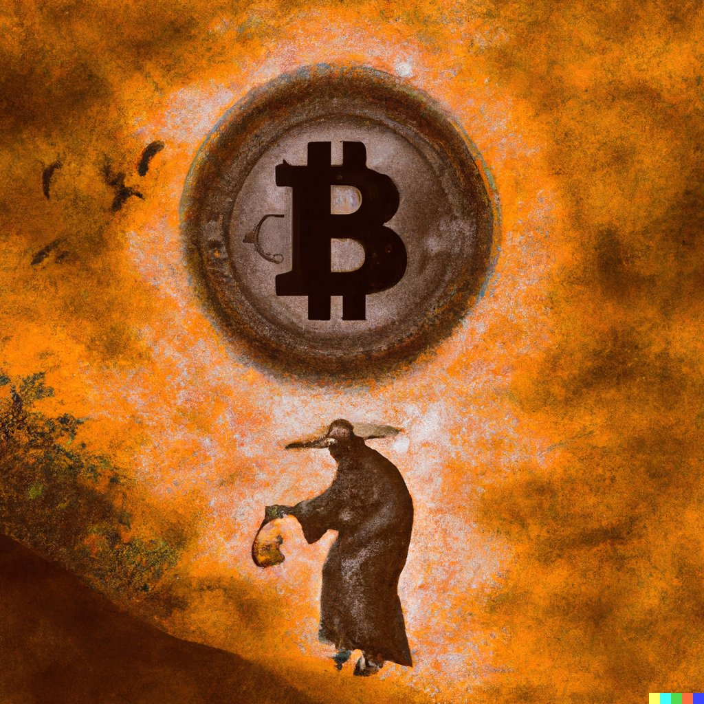

# PaintGlyphs NFT

什么是字形？
我们正在寻找发现奥秘，抓住本质，了解世界。

PaintGlyphs 是由 AIA 创建的 10,000 个类似曼荼罗的图像，既诱人又独特。它们标志着开始，通往新系列和新世界的旅程。在另一边见。

PaintGlyphs NFT NFT - 常见问题（FAQ）
▶ 什么是 PaintGlyphs NFT？
PaintGlyphs NFT 是一个 NFT（Non-fungible token）集合。存储在区块链上的数字艺术品集合。
▶ 存在多少 PaintGlyphs NFT 代币？
总共有 433 个 PaintGlyphs NFT NFT。目前，126 位所有者的钱包中至少有一个 PaintGlyphs NFT NTF。
▶ 最近卖出了多少 PaintGlyphs NFT？
在过去 30 天内售出了 0 个 PaintGlyphs NFT NFT。

