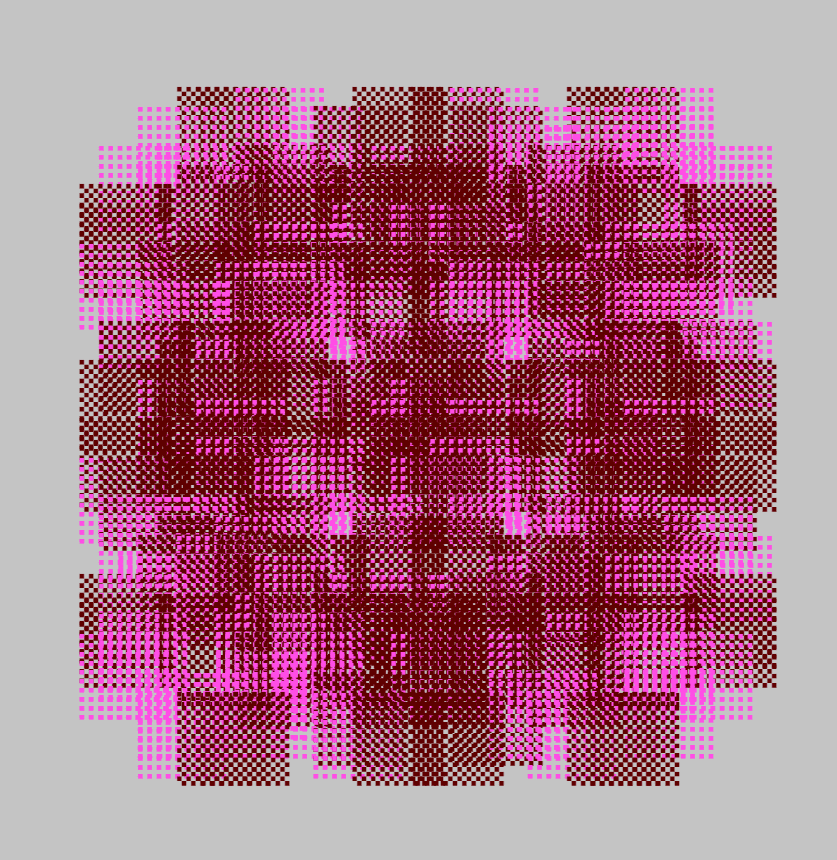

# Paintglyphs V2

Paintglyphs 是动态且可升级的艺术，其灵感来自 Autoglyphs。 引入了新的符号、大小和机制，但原始绘图算法已重新用于 Paintglyphs。虽然 Cryptopunks 激发了无数衍生产品，但 Autoglyphs 在很大程度上仍然是孤立的，唯一重要的例外是 Colorglyphs。 Paintglyphs 对 Autoglyphs 进行了全新的诠释，同时保持与原始设计的接近。

自动字形是以太坊区块链上第一个“链上”生成艺术。它们是艺术品创作和所有权的完全独立的机制。

Colorglyphs是Larva Labs无与伦比的Autoglyphs项目的扩展。每个 Colorglyph 都是自体字形的彩色版本。

