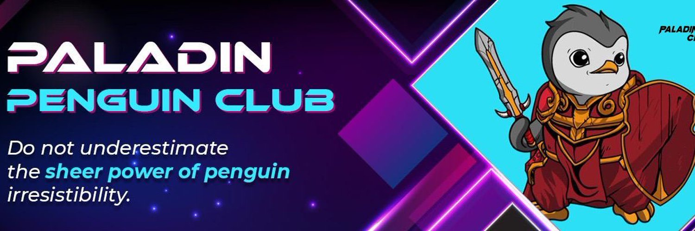

# Paladin Penguin Club

每个 Paladin Penguin 身份都是手绘艺术和独一无二的算法输出的结合，这就是为什么每个 Paladin Penguin 都是稀有的、鲜活的、会呼吸的艺术品，拥有自己独特的历史。

拥有超过 150 种手绘特征，拥有一个 Paladin Penguin 将自动成为一个封闭的、独家的 Paladin Penguin 收藏家团体的会员，拥有巨大的现金福利、独家实用程序和一个游戏来赚钱的游戏。
Paladin Penguin Club 是 8,888 个独特的 Paladin Penguin 角色的集合，每个 Paladin Penguin的所有权证明作为ERC-721 Non-Fungible Token存储在以太坊网络上.

