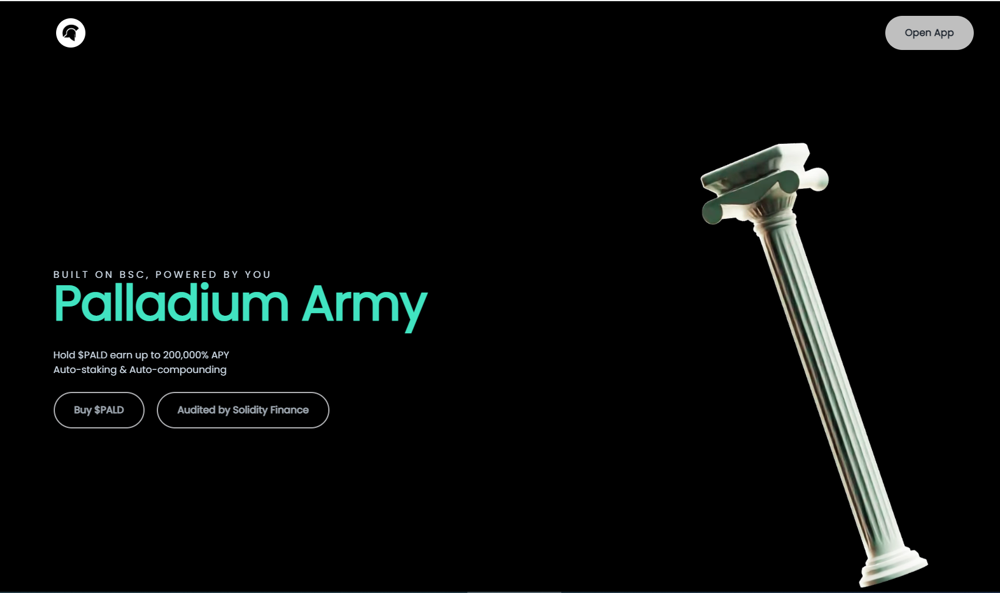

# Palladium Finance

名称：钯金金融

年利率：151,631.1%

代币：$PALD

\- 由 Solidity Finance 审计。

-Multisig 转移资金以提高安全性。

-我们将成为 BSC 上第一个加入 Sphere 的量子流动性池的项目，以增加协议的可持续性。

-MC 低，因此有很大的增长潜力。

-我们已经实施了 DAO，因此社区可以参与并决定项目的更新。

-目前正在考虑实施 NFT，为我们的持有者带来有益的回报。

Palladium Army 正在通过 Palladium Autostaking 协议 (PAP) 改造 DeFi，该协议提供业界最高的固定 APY，每 30 分钟重新计算一次奖励，以及一个简单的买入持有收益系统，可以快速增加您钱包中的投资组合。

Palladium 为 Paladins 持有者创造利益和价值。我们的 PAP 协议以 Palladium 代币发行，为 $PALD 持有者带来特殊利益：

固定 APY — 波动的 APY 意味着您永远无法知道您将收到多少代币，Palladium Autostaking 协议向 $PALD 持有者支付固定利率每天 2% 或每年复合 151,631%。

简单安全的质押——您只需购买并持有 $PALD，因为您会自动在自己的钱包中收到奖励。无需将您的代币移至我们的网站，因此无需将其交到第三方或中央机构手中。从您购买的那一刻起，您将获得 rebase 奖励。DeFi 中最简单的自动质押。

快速变基奖励——Palladium 协议每 30 分钟或每天 48 次向每位 $PALD 持有者支付费用，而其他协议每 10 小时支付一次变基奖励，这意味着可能会受到波动的影响。

复利功能 - 利息收益率自动支付并在您自己的钱包中复利，保证您不会错过任何付款。
