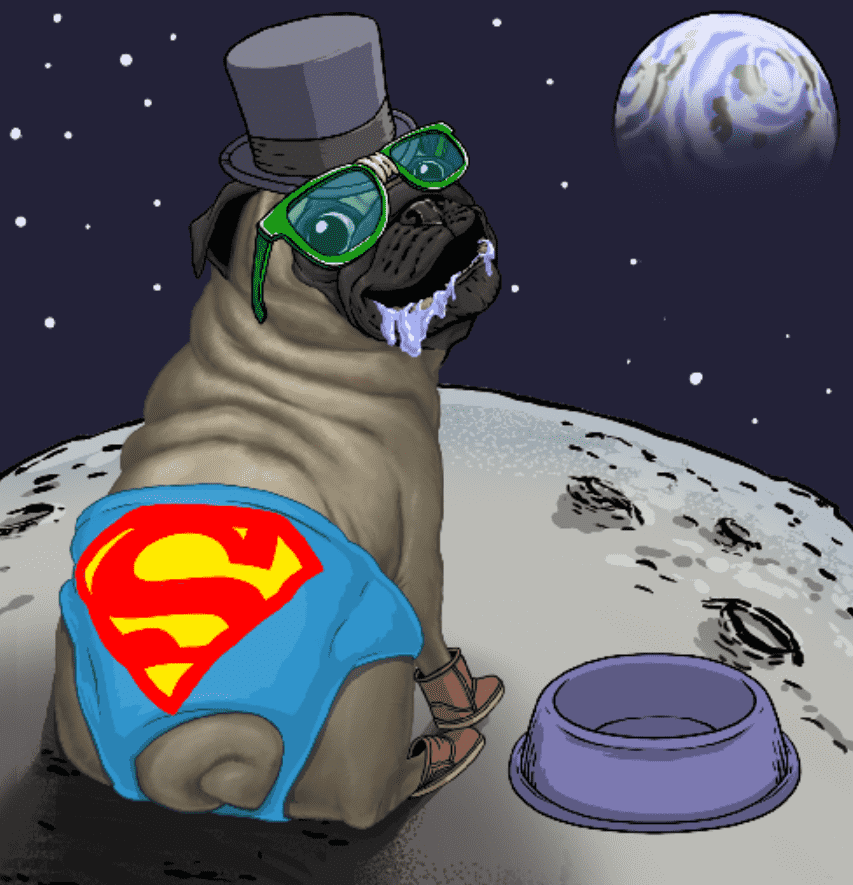

# Pampered Pugs

哈巴狗曾几何时，在 Pugzania 王国的兽医诊所，Pug 教授忙于工作，试图治愈哈巴狗的各种遗传条件，这些遗传条件是人类通过几个世纪的繁殖灌输给它们的。 帕格教授正处于重大突破的边缘，然而在一系列不幸的事件中，一个标有 QT-4 的小瓶在他没有注意到的情况下被洒进了他正在调制的治疗药物中。
在第一批哈巴狗开始表现出化学物质的影响之前，他已经给哈巴狗治疗了。 这些副作用导致哈巴狗不受控制地到处拉屎。 这是一个非常糟糕的情况。 教授不得不对每一只哈巴狗都进行呵护。 然后教授开始集思广益，想办法帮助这些哈巴狗。

