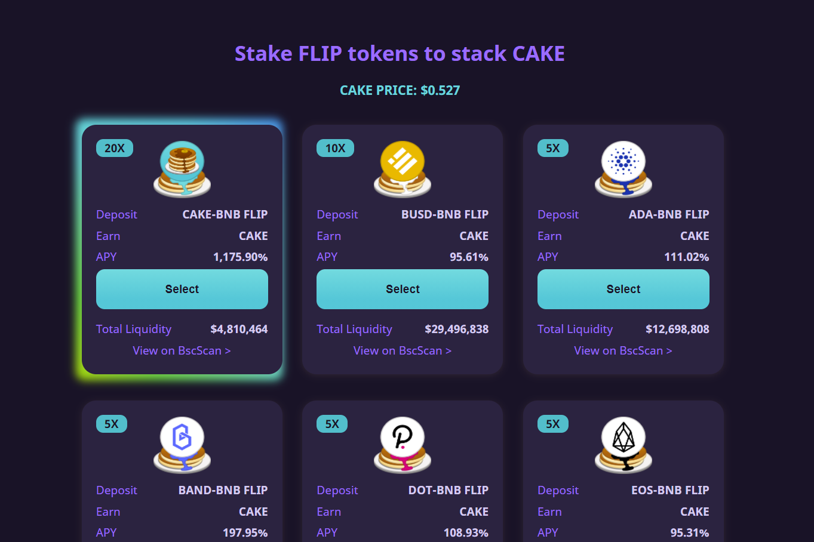

# PancakeSwap

PancakeSwap 是一家自动化做市商（“AMM”），允许在币安智能链上交换两种代币。它快速，便宜，并且允许任何人参与。

**梦想？**

成堆的煎饼、糖浆、生奶油。

早餐后，PancakeSwap 的目标是成为 Binance Smart Chain 上排名第一的流动性提供者，以及新的、创新的游戏化农业机制的发源地，我们怀疑其中许多机制将进入其他链及其他链。
