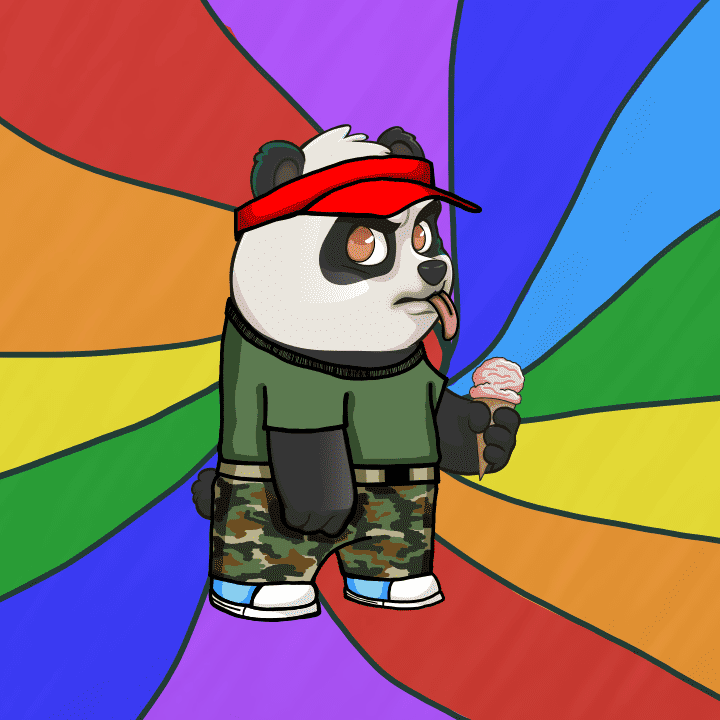

# Panda Fight Club

什么是熊猫搏击俱乐部？
熊猫搏击俱乐部是从 100 多个手工制作的属性中随机生成的 8,888 个 NFT 的集合。每个熊猫都可以访问熊猫搏击俱乐部！来吧，让我们继续阅读。😉

为什么要养熊猫？
这引起了人们的注意！该团队目前正在搏击俱乐部努力工作，让持有者能够相互战斗。虽然战斗正在进行中，但熊猫被托管在区块链上，赢家通吃！不要担心不是每个人都是战士。无论是否战斗，您的熊猫都将成为历史的独特部分。🎲

好吧，他们多少钱？
没有价格等级，没有联合曲线。Pandas 持平（0.0888 ETH）。在销售结束时，部分收益将捐赠给 Pandas International。🐼

