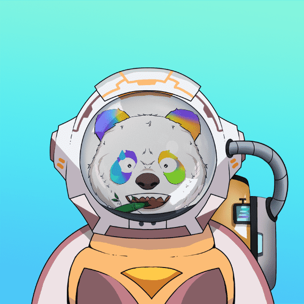

# Panda Astronaut Club

PAClub 是一家专注于 GameFi 和 Metaverse 的 Venture DAO，旨在探索基于区块链的新兴资产投资机会。PAClub 构建了第一个 NFT 治理模型。PAClub 共发行 1,000 张熊猫宇航员俱乐部 (PAC) NFT 作为会员票。所有参与者都需要持有 PAC NFT 才能获得 PAClub 孵化器 Venture DAO 等社区权益。

1000 熊猫宇航员俱乐部 NFT 由 Planet DAO 创建。拥有The astronaut NFT的会员可以参与Planet DAO的运营和决策，获得相关的社区权益。NFT 具有访问、治理、提案、价值捕获和其他相关功能。

