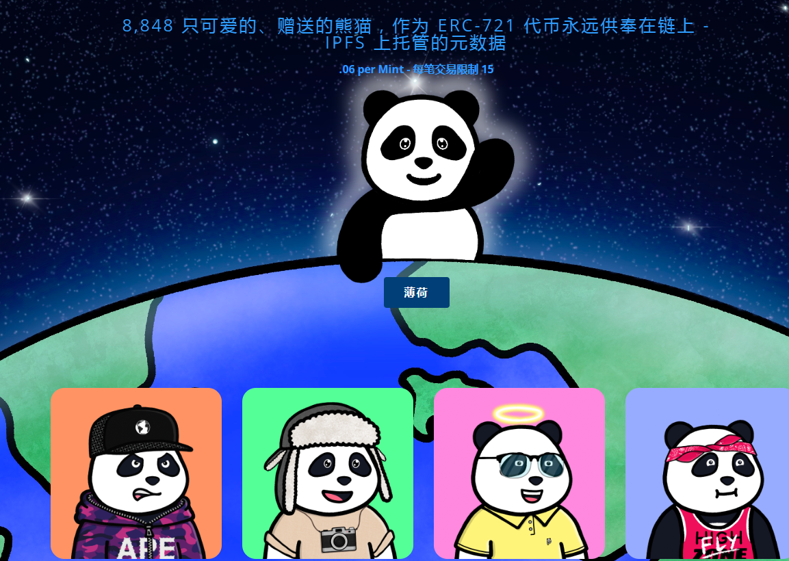

# Pandamonium World

这 8,848 只熊猫生活在混乱为王的熊猫世界，一切皆有可能。Pandamonium World 充满了生命、欢乐和各种动物，既酷又混乱。
这些不仅是你见过的最可爱、最聪明的熊猫，而且它们还非常给熊猫提供了令人难以置信的礼物。这些小熊猫由 150 多个特征独特生成，已准备好上链！
Genesis Pandas销售的 30% 将在销售后不久捐赠给慈善机构。这些慈善机构已经过预先选择和审查，捐款将在链上进行，您可以在下面阅读更多关于它们的信息。捐赠地址已内置在我们的合同中。我们一直与 The Giving Block 的领导层直接接触，并打算使用他们的服务来提高透明度。
二级销售的 30% 版税也将用于帮助支持有价值的事业。30% 的二次费用将退还给持有人。剩余的费用份额将用于持续开发。
我们最兴奋的第一个产品是我们的代币化定制平台。个性化对于数字身份非常重要，并且在当前市场中的代表性不足。在我们的平台上，创作者将能够生产、铸造和分发他们自己的定制配件或服装作为单独的 NFT。这是与简单覆盖附加艺术的一个重要区别——毕竟，链可验证所有权是我们都在这里的原因！用户将能够携带他们现有的 NFT，并从选定的配饰、服装、发型中进行选择——创造者可以梦想的任何东西！熊猫所有权将是使用该平台所必需的。

