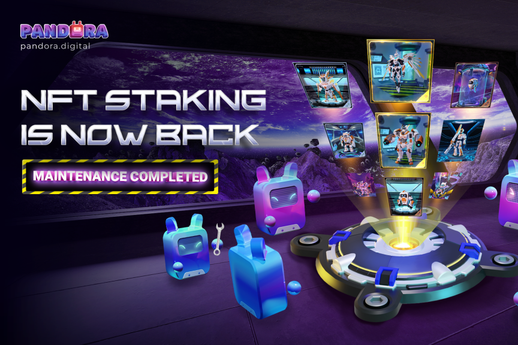
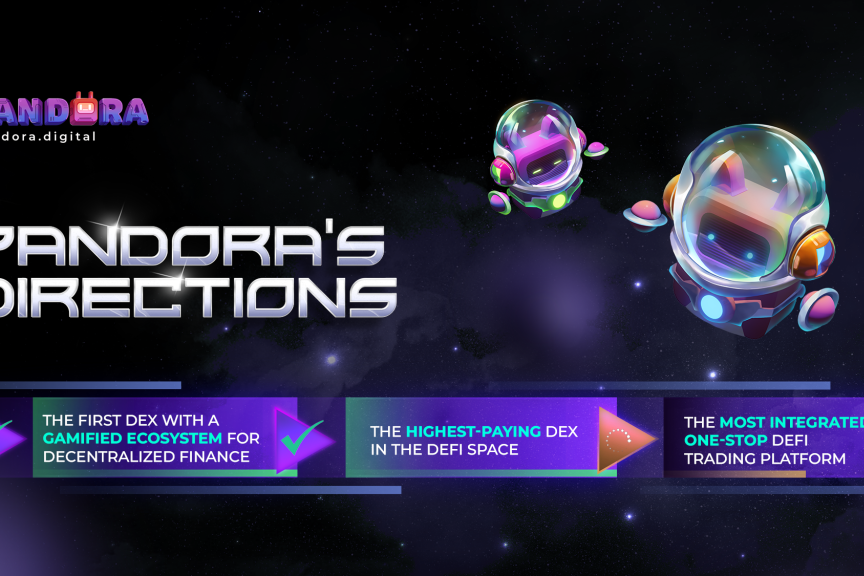

# Pandora Digital

PANDORA 是基于游戏化 DEX 和 IDO 启动板的下一代去中心化生态系统，为每个人提供整体和身临其境的 Defi 体验，同时使早期加密投资者能够在当今新兴的基于区块链的项目中找到明天的加密宝石。 

PANDORA 以成为 DeFi 领域收入最高的 DEX 和第一个为去中心化金融引入游戏化系统的 DEX 而感到自豪。 

Pandora 提出了双代币模型——由两个代币授权的去中心化生态系统。

双通证系统的采用使用户能够在参与协议的同时最大限度地发挥他们的盈利潜力。

此实施还允许更好地利用这两种代币，这意味着可以在适当的时候开发更多与这两种代币相关的用例并将其添加到 Pandora 生态系统中，以使所有相关利益相关者受益。
