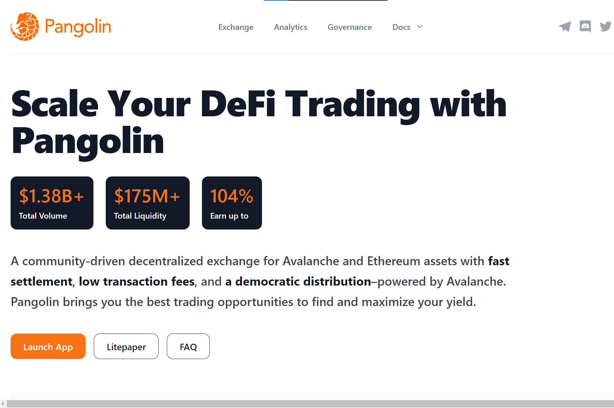
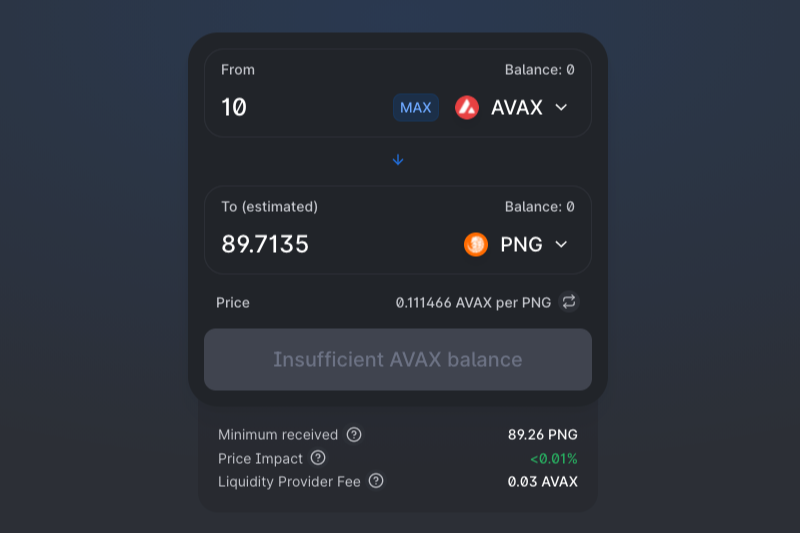

# Pangolin Exchange

Pangolin 是在 Avalanche 上运行的去中心化交易所 (DEX)，使用与 Uniswap 相同的自动做市 (AMM) 模型，具有名为 PNG 的本地治理代币，该代币是完全社区分发的，能够交易在以太坊上发行的所有代币和雪崩。在一个拥有多个竞争者的拥挤市场中，Pangolin 提供了三个至关重要的好处：快速廉价的交易、社区驱动的开发以及公平和公开的代币分配。首先，Pangolin 可以快速且廉价地完成交易。由于 Pangolin 是基于 Avalanche 构建的，它使用户能够在享受亚秒级交易终结性和低至几美分的交易费用的同时交换资产。通常，在 Pangolin 上的交易会感觉和在中心化交易所的交易一样快。第二，除了对技术现状的重大性能升级之外，Pangolin 是社区驱动的。原生治理代币 PNG 使社区能够全面推动产品的开发。第三，但同样重要的是，Pangolin 具有 100% 以社区为中心的代币分发模式，这意味着所有代币都直接分发给社区，无需分配给团队、顾问、投资者或内部人员。Pangolin 是对其他 AMM 面临的这两个关键问题的回应：低于标准的绩效和有利于少数大股东的治理控制。使用 Pangolin，用户将能够享受类似于中心化交易所的速度，而无需损害对其现有资产组合的访问权限，也无需将控制权交给大型内部人员。使社区能够全面推动产品的发展。第三，但同样重要的是，Pangolin 具有 100% 以社区为中心的代币分发模式，这意味着所有代币都直接分发给社区，无需分配给团队、顾问、投资者或内部人员。Pangolin 是对其他 AMM 面临的这两个关键问题的回应：低于标准的绩效和有利于少数大股东的治理控制。使用 Pangolin，用户将能够享受类似于中心化交易所的速度，而无需损害对其现有资产组合的访问权限，也无需将控制权交给大型内部人员。使社区能够全面推动产品的发展。第三，但同样重要的是，Pangolin 具有 100% 以社区为中心的代币分发模式，这意味着所有代币都直接分发给社区，无需分配给团队、顾问、投资者或内部人员。Pangolin 是对其他 AMM 面临的这两个关键问题的回应：低于标准的绩效和有利于少数大股东的治理控制。使用 Pangolin，用户将能够享受类似于中心化交易所的速度，而无需损害对其现有资产组合的访问权限，也无需将控制权交给大型内部人员。这意味着所有代币都直接分配给社区，而不分配给团队、顾问、投资者或内部人员。Pangolin 是对其他 AMM 面临的这两个关键问题的回应：低于标准的绩效和有利于少数大股东的治理控制。使用 Pangolin，用户将能够享受类似于中心化交易所的速度，而无需损害对其现有资产组合的访问权限，也无需将控制权交给大型内部人员。这意味着所有代币都直接分配给社区，而不分配给团队、顾问、投资者或内部人员。Pangolin 是对其他 AMM 面临的这两个关键问题的回应：低于标准的绩效和有利于少数大股东的治理控制。使用 Pangolin，用户将能够享受类似中心化交易所的速度，而无需损害对其现有资产组合的访问权限，也无需将控制权交给大型内部人员。
