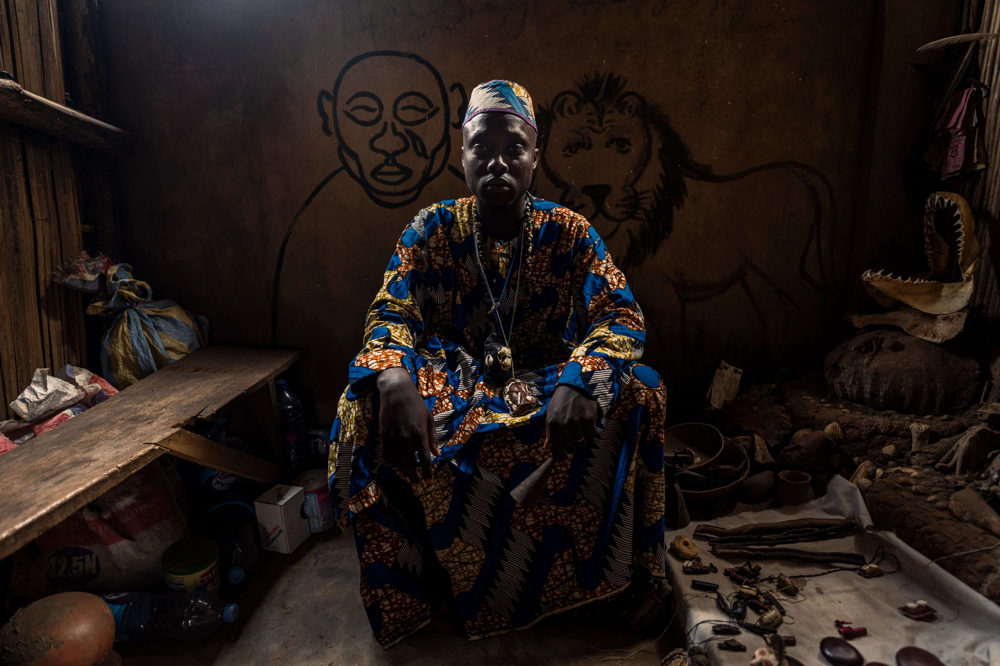

# Panoramic Portraits

Panoramic Portraits NFT 在过去 7 天内售出 1 次。全景肖像的总销售额为 970.77 美元。一张全景肖像 NFT 的平均价格为 970.8 美元。共有 35 位全景肖像所有者，拥有 50 个代币的总供应量。

4 年内来自世界许多地方的全景人像照片。Rizacan Kumas 在拍摄照片时关注人们的感受和故事。此系列中最多将铸造 50 张照片。

▶ 什么是全景人像？
Panoramic Portraits 是一个 NFT（非同质代币）集合。存储在区块链上的数字艺术品集合。
▶ 全景肖像代币有多少？
总共有 50 个全景肖像 NFT。目前，35 位所有者的钱包中至少有一张全景肖像 NTF。
▶ 最昂贵的全景肖像拍卖会是什么？
出售的最昂贵的全景肖像 NFT 是 全景肖像 #44。它于 2022 年 8 月 6 日（28 天前）以 280 美元的价格售出。
▶ 最近卖出了多少全景人像？
过去 30 天内共售出 3 个 Panoramic Portraits NFT。

