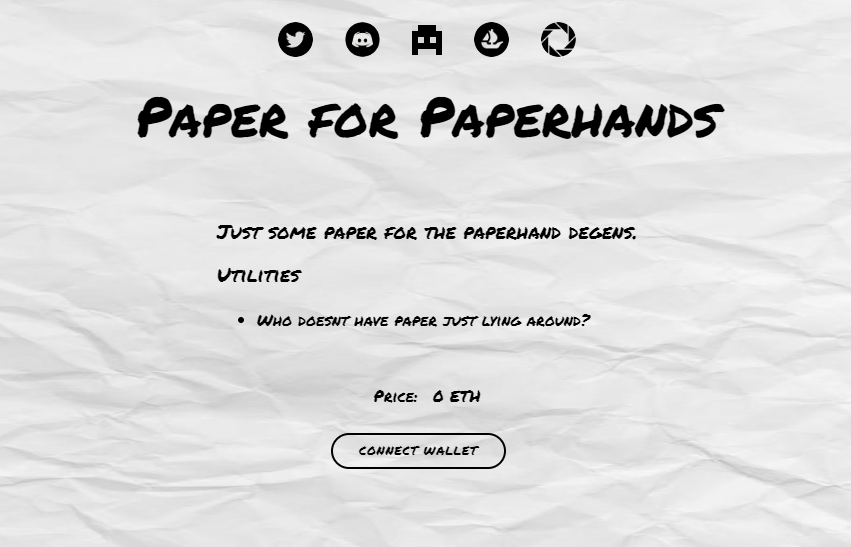

# Paper for Paperhands

Paper for Paper Hands 是首创的 Phygital NFT 集合，可兑换为您的 NFT 显示的实际对象。如果正确兑换，您应该能够打印出完整的 8x11 艺术品复制品，供您展示和欣赏，无论您身在何处。Paper for Paper Hands 有很多用途。购物清单、笔记、数学题，无限可能，只限你的想象力！

什么是Paper for Paper Hands ？
Paper for Paper Hands  是一个 NFT（非同质代币）集合。存储在区块链上的数字艺术品集合。
▶ 有多少Paper for Paper Hands  代币？
总共有2400个 Paper for Paper Hands NFT。目前，484 位车主的钱包中至少有一个 Paper for Paper Hands 

