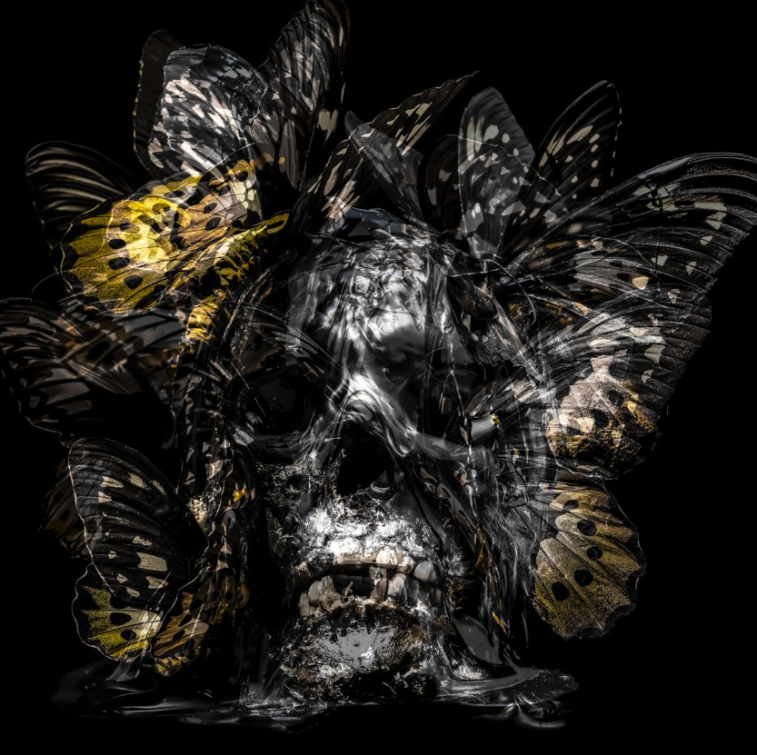

# Papillon by Philippe Pasqua

菲利普·帕斯夸（Philippe Pasqua，1965 年出生于格拉斯）在 18 岁时被绘画所吸引，开始在棕色包装纸和床单上“涂鸦”，从那时起他就不断尝试自己的艺术，掌握材料，完善自己的技术，成为他这一代的主要艺术家。今天，雕塑在他的创作中扮演着重要的角色。他的作品采用象征力量、纯洁或永恒的材料制作，具有视觉冲击力和纪念意义。

Philippe Pasqua 的第一部作品于 1997 年制作，其中嵌入了一个头骨，多年来，该头骨已成为他作品的主题和标志。这件作品是虚荣传统的一部分，是艺术史的主要组成部分，被定义为死亡、时间流逝、生命脆弱与人类职业空虚形成对比的寓言形象。

每个集合中的 NFT 将直接访问暗影神殿。阴影神殿将是菲利普·帕斯夸 (Philippe Pasqua) 的沉浸式体验，旨在超越任何敢于进入的人。

艺术家通过他们的作品激发无限独特的情感，这种体验将强化这些情感，将整个艺术体验提升到一个新的水平。进入 SOS 就像进入艺术家最隐秘的地方：他的思想。喜悦、恐惧、想法、记忆、能量……你将能够感受到所有这些深刻的感受和情绪。该体验是在虚幻引擎 5 上制作的，让持有者能够体验到超现实的体验

