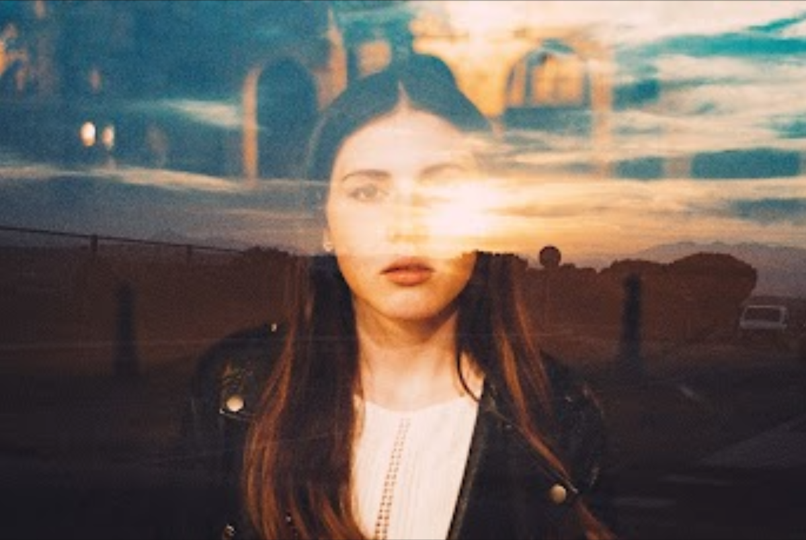

# Paradis Bleu - Editions by Louis Dazy

Louis Dazy是法国巴黎的概念摄影师兼导演。
他的方法结合了肖像画、街头摄影和灯光作品，创造出极具感染力的电影图像。Dazy 主要从事电影工作，通过使用双重曝光的过程为他的图像带来层次感。
这些图像是由天鹅绒般的黑暗、发光的霓虹灯和星光闪烁的火花创造出来的，承载着梦幻记忆或电影叙事的所有力量。他采用直观的方法来传达怀旧和忧郁的感觉，他的许多作品都捕捉到了外在的魅力和私人的沉思。每一张图片都创造了一个深刻的时刻，暗示着深刻的情感和持续的动作，因此他的作品与我们更熟悉的音乐视频和黑色电影中的图像紧密结合。
他还结合了文字，通常以霓虹灯的形式书写，增加了一层意义，通过图像、颜色和文字的融合创造了情节点。总体而言，Dazy 的作品将我们带入令人陶醉的永恒潮流，体现了 1950 年代的魅力、1970 年代的性感和 1980 年代的高压，将法国电影风格与亚洲超级城市和美国餐厅美学融合

