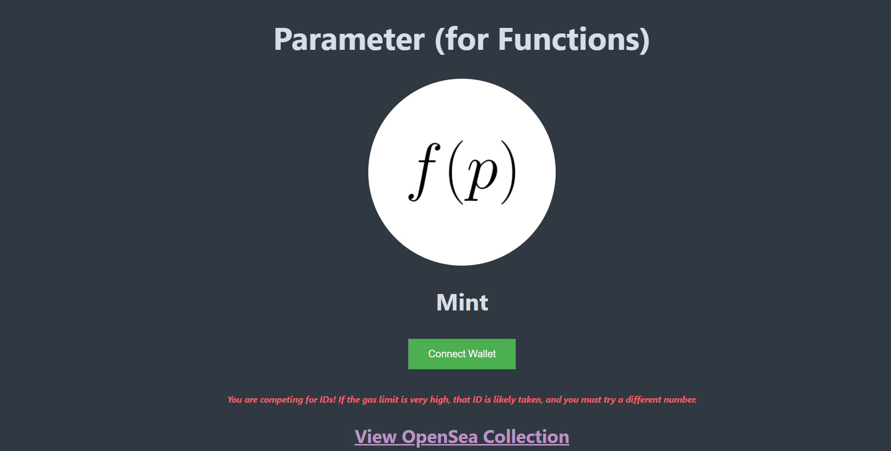

# Parameter (for Functions)

你得到什么： - 一个布尔值 - 一个数字 - 一个两位数 - 一个三位数 - 一个字符 - 一个十六进制颜色 - 第二个十六进制颜色 - 一个逻辑运算符

任何行都可以有一个额外的单个数字参数

有些可能有一个额外的单个数字和字符

在极少数情况下，参数可能为空

让你的想象力带我们去兜风吧，创作者和开发者。随心所欲地在函数中使用这些参数。
最后该开发商目前没有未来的计划。社区可以自由地使用这些 NFT 做他们想做的事。

