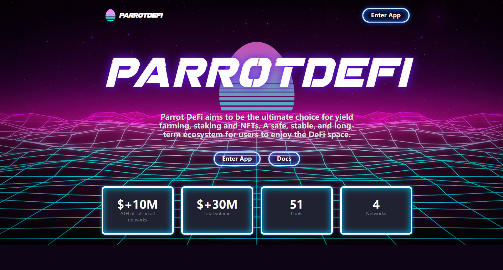

# ParrotDeFi

**什么是 Parrot Defi？** 

Parrot DeFi 是一个去中心化的收益农业和 NFT 多链平台，在 Matic、IoTeX、Arbitrum 和 Harmony 上运行。  

1PEGG（Harmony Parrot Egg）是原生代币，是 Parrot Defi on Harmony 协议的核心基础。 

**1PEGG 实用代币用于：** 

- 通过快照 DAO 进行治理 
- 耕种和质押奖励  
- DEX费用扣除  
- NFT 收购。  

**Parrot Defi on Harmony 将具有以下特点：**  

- 流动性挖矿的流动性池。 
- 单一质押池可赚取 1PEGG 奖励。  
- 用于赚取不同代币的多奖励金库。  
- 孵化器，一种高效的分层耕作燃烧机制。 
- NFT。

有多少 1PEGG 在流通？ 

1PEGG 于 2021 年 11 月 30 日在 Harmony Protocol 上公平上线，80,000 

1PEGG 代币是在创世时创建的。供应量上限为 100 万个代币，发射率设置为每块 0.4 个 1PEGG。发射率将逐渐更新为相应的双曲线。  

**Parrot Defi 的团队是谁？** 

Parrot Defi 的核心团队由经验丰富的企业家、智能合约开发者、项目经理和加密爱好者组成；并且一直对 EVM 感到兴奋，并致力于支持 DeFi 的未来。该团队已对 MCN Ventures、IoTeX 和 Harmony 的核心团队进行了 KYC。
