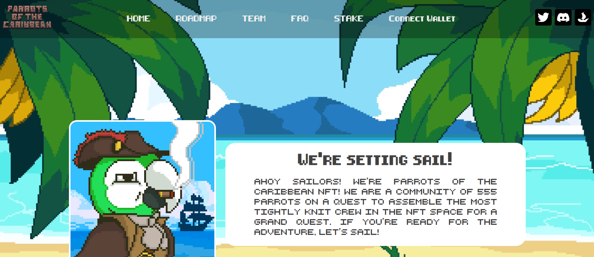

# Parrots of the Caribbean V2

啊，水手们！我们是加勒比 NFT 的鹦鹉！我们是一个由 555 名 Parrots 组成的社区，旨在召集 NFT 空间中最紧密的工作人员来完成一项宏伟的任务。如果您已准备好冒险，那就启航吧！
我们有 100 多个特征。每个身体特征都基于加勒比国家国旗的颜色，我们有 10 个传奇人物 - 每一个都基于来自加勒比地区的杰出文化/历史人物。
加勒比地区以其阳光、温暖、家庭和良好的氛围而闻名。作为我们自己加勒比海的居民，我们想在 NFT 空间中创建我们自己的岛屿，就像加勒比海的一部分。于是，加勒比鹦鹉诞生了。我们有一个座右铭：“One Crew On One Mission”，而这个使命就是在 NFT 领域掀起波澜。
我们将通过奖学金和当地区块链训练营为加勒比地区的下一代 Web 3 人才铺平道路。Web 3 正在以闪电般的速度发展，我们希望确保加勒比地区不会在这波浪潮中落后。我们还在 NFT 的世界中创造一个空间，让人们可以体验加勒比文化的温暖。与我们一起启航，带您前往 NFT 的热带探险。

