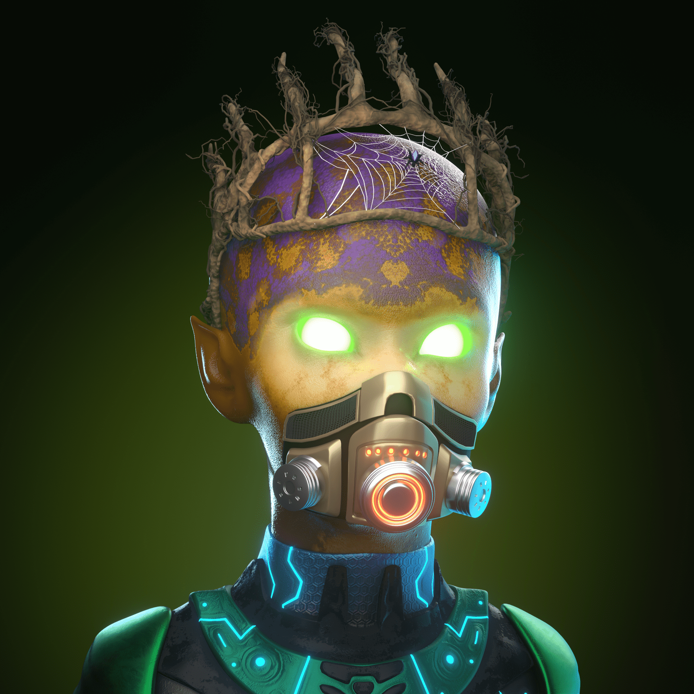

# Particlone

Particlon 正在通过带电粒子协议突破实用性和可能性的界限来引领下一代 NFT，该协议是 2020 年初的 NFT 协议，允许您在 NFT 内嵌套额外的资产（可替代或不可替代）。每个 Particlon 都嵌套了 $PUT 代币，在我们的游戏生态系统中使用这些代币 - 明智地使用它们。拥有一个 Particlon 还可以让您免费访问由我们的合作伙伴 VASI 主办的所有代币门控元界活动。这些活动包括音乐、喜剧、艺术画廊等。享受独家见面会和问候、商品等的优势......存在 3,333 个粒子。在 app.charged.fi 上查看其中的内容。

