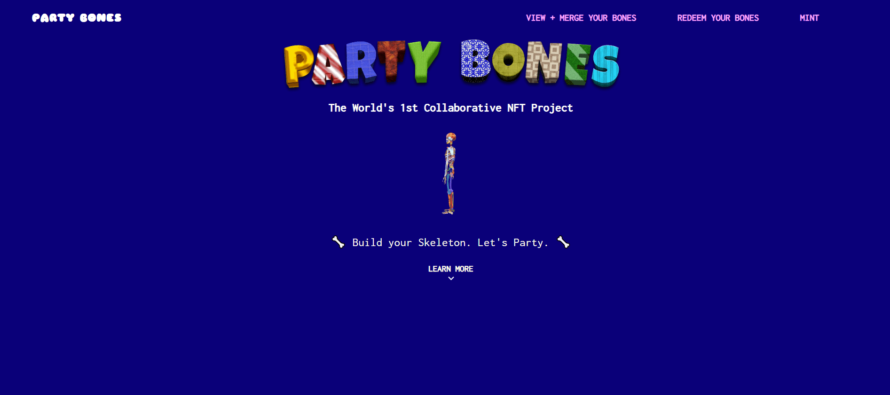

# Party Skulls

Party Bones 是一个 NFT 集合，包含 206 个骨骼 * 50 个纹理 -> 10,300 个人体骨骼的 3-D 建模 NFT。如果您拥有多个骨骼 NFT，则可以将它们合并在一起以创建更大的骨骼结构，最终目标是制作完整的骨骼。
我们的合同中有多种功能允许您将某些派对骨骼合并在一起。您必须拥有所有必需的骨骼才能在一个钱包下创建某个肢体，一旦功能成功，所有提交的用于创建新身体部位的代币将被烧毁并替换为单个 1 of 1 NFT 与新的身体部位。
我们的项目是艺术品驱动的，旨在吸引 NFT 空间内的真正收藏家，他们希望与该领域的其他收藏家一起踏上旅程。如果没有与其他社区成员的互动，就不可能完成身体部位 - 因此，我们的目标是使其成为一种协作体验，最终目的是完成全人类共有的东西 - 人体骨骼。
完成这一壮举的好处在于铸造身体部位本身的排他性和稀有性。诚然，创建一个完整的派对骨架是一项不可轻视的努力——但一旦完成，您将持有最独特、最稀有的 NFT，我们希望这将是一个成功的项目。艺术品本身已经被 NFT 空间内外的艺术鉴赏家审查过。我们的目标（我们喜欢为明星而战）——让派对骨架成为最有价值和最受欢迎的 NFT 之一。

