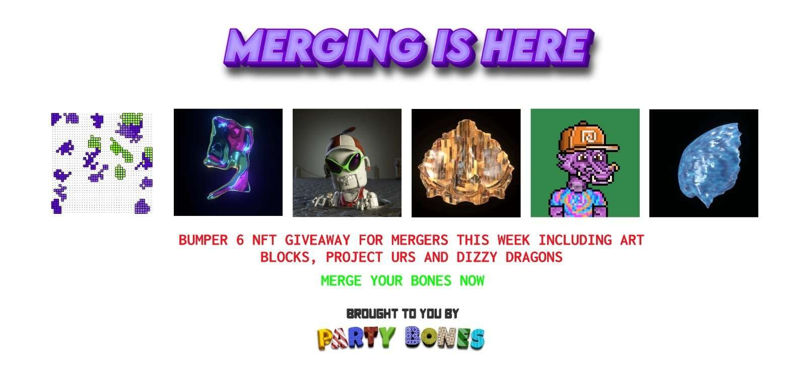

# Party Bones

Party Bones 是第一个 NFT 集合，包含 206 个骨骼 * 50 个纹理 -> 10,300 个人体骨骼的 3-D 建模 NFT。如果您拥有多个骨骼 NFT，则可以将它们合并在一起以创建更大的骨骼结构，最终目标是制作完整的骨骼。

我们免费赠送了近 1000 个名为 PARTY SKULLS 的 2D NFT！这些可作为派对骨头独家活动的门票、赠品，并让您尽早获得我们的销售机会。他们不是派对骨头！我们还添加了奖励参与的“进化”功能。我们热爱我们的社区，并希望表达我们的感激之情。

每个 NFT 都是 1/1 完全独特的设计，以最高品质为您手工制作。骨头本身覆盖了从熔岩到奶酪纹理的各种纹理！NFT 的 3D 方面将允许未来更轻松的元节集成。

