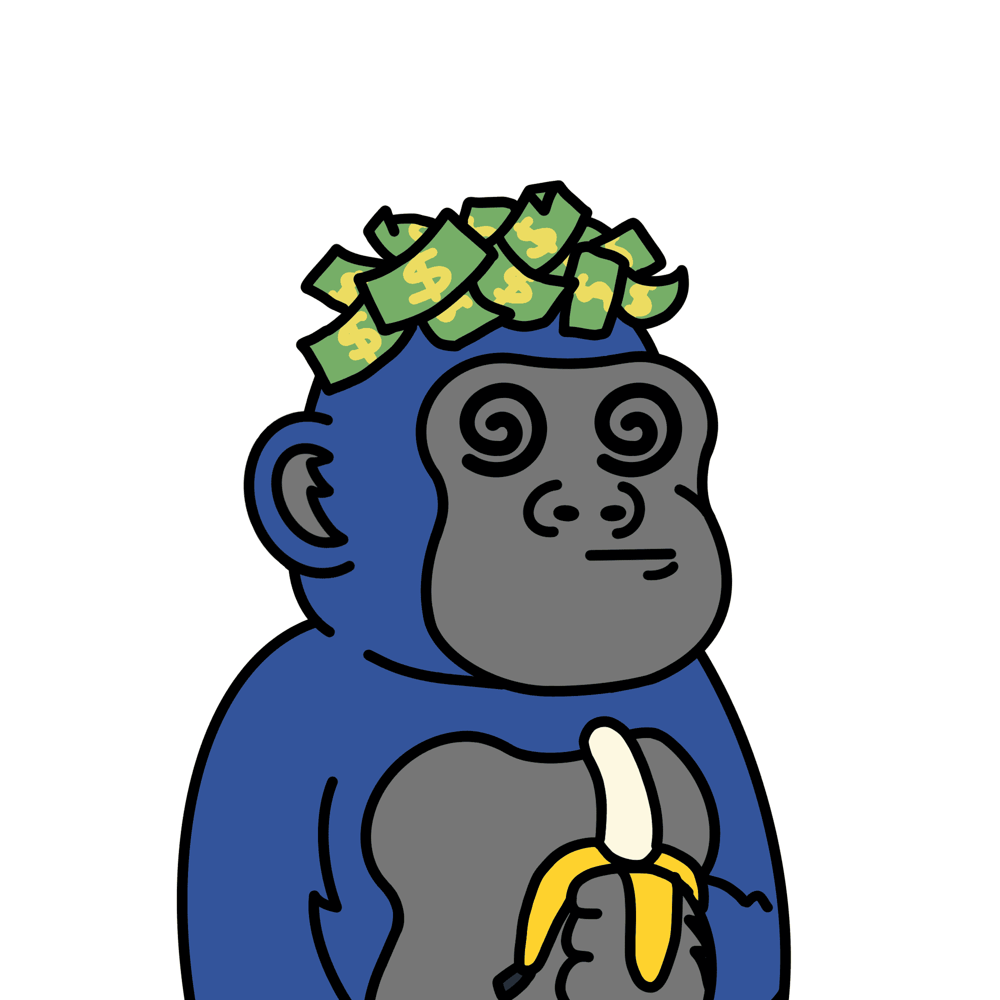

# Party Gorillas

 什么是派对大猩猩？
Party Gorillas 是一个 NFT（非同质代币）集合。存储在区块链上的数字艺术品集合。
 派对大猩猩代币有多少？
总共有 1,940 个 Party Gorillas NFT。目前，326 位车主的钱包中至少有一个 Party Gorillas NTF。
 最昂贵的派对大猩猩销售是什么？
售出的最昂贵的 Party Gorillas NFT 是 PartyGorillaz #828。它于 2022-06-07（3 个月前）以 14.5 美元的价格售出。
 最近卖出了多少只派对大猩猩？
过去 30 天内售出了 4 个 Party Gorillas NFT。

