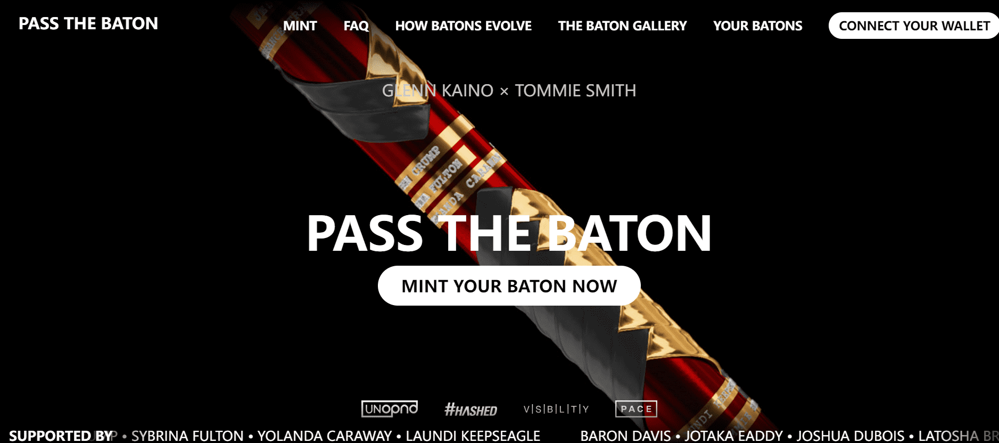

# Pass the Baton

传递接力棒是一个艺术项目，旨在庆祝汤米·史密斯在 1968 年奥运会的颁奖典礼上在领奖台上举起拳头抗议人权的标志性抗议活动。受到在四场破纪录比赛中使用的接力棒 Tommie 的启发，7,872 个数字渲染的接力棒 NFT 将 Tommie 的致敬以及团结和坚持不懈的信息带入了数字空间。该项目与 24 位争取人权的倡导者、活动家和变革者——汤米的遗产团队——合作，使用区块链技术推动有意义的变革。随着接力棒的传递，智能合约会触发对遗产团队成员在每个接力棒上选择的非营利组织的捐款。随着捐款的增加，警棍会进化出更稀有的属性。民权是一场代际斗争，这个项目为那些为子孙后代扛起接力棒的人创造了至关重要的持续支持。

