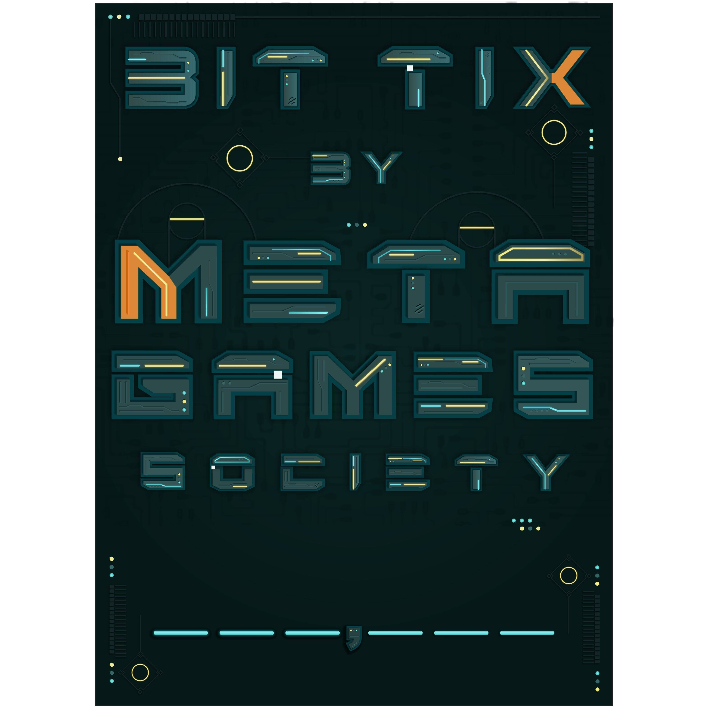

# PastelFkrs

▶ 什么是 PastelFkrs？
PastelFkrs 是一个 NFT（不可替代令牌）集合。存储在区块链上的数字艺术品集合。
▶ 有多少 PastelFkrs 代币？
总共有 1,000 个 PastelFkrs NFT。目前，24 位所有者的钱包中至少有一个 PastelFkrs NTF。
▶ 最近卖出了多少 PastelFkrs？
过去 30 天内售出 0 个 PastelFkrs NFT。

