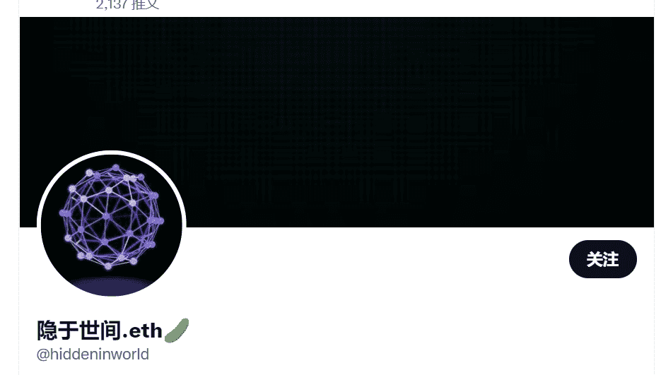

# Pattern NFT by HiddenInTheWorld

200 模式 NFT，只能通过合约铸币来铸币，较低的 id = 更多线性奖励。

未来 Pattern NFT 的占有率 = 1200/(id+1200)。如果您知道要购买什么 Etherscan，则只有薄荷。

你好，我是从 tasbur 出版的。您可以看看我们有前途的产品，您可以在其中找到数以千计的 NFT。

2022年的元界，Web3是这样运作的，“爷爷在2022年买了一些X，Y坐标，而他的朋友买了Otherside

