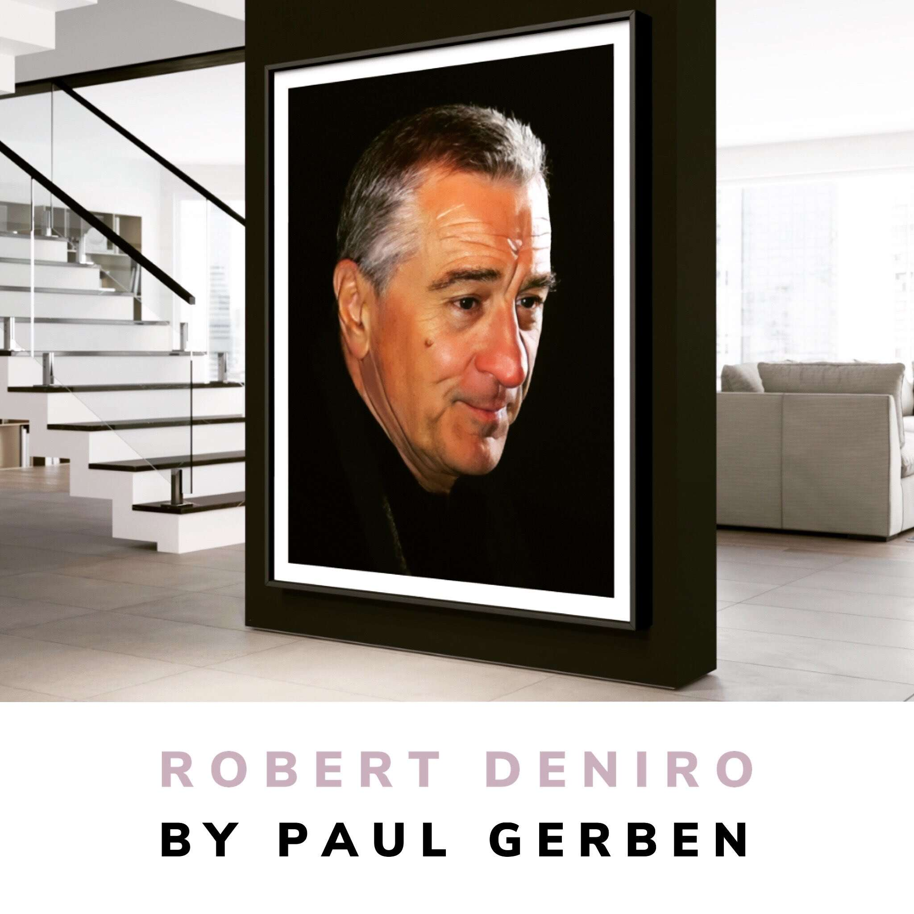

# Paul Gerben

官方 Paul Gerben NFT 原创艺术、设计和混合媒体动画收藏。

一个土生土长的纽约人，保罗·格本的混合媒体作品反映了城市景观的原始能量，通过微调的图形眼睛过滤。他的一系列抽象作品、部落面具和物体展示了他对色彩和敏锐视觉的流畅运用。他的名人肖像涵盖了整个光谱，
他的各种系列作品包括抽象和超现实主义动物、流行文化、时尚和 20 世纪偶像。他的作品已经扩展到新材料和主题，从冲浪板到大型室内和室外公共雕塑。
格本 7 岁就开始绘画，并一直受到他富有创造力的艺术家母亲的鼓励去追求艺术事业 格本就读于罗德岛设计学院和纽约普拉特学院。他目前居住在纽约，他的作品在全国各地的画廊中展出

