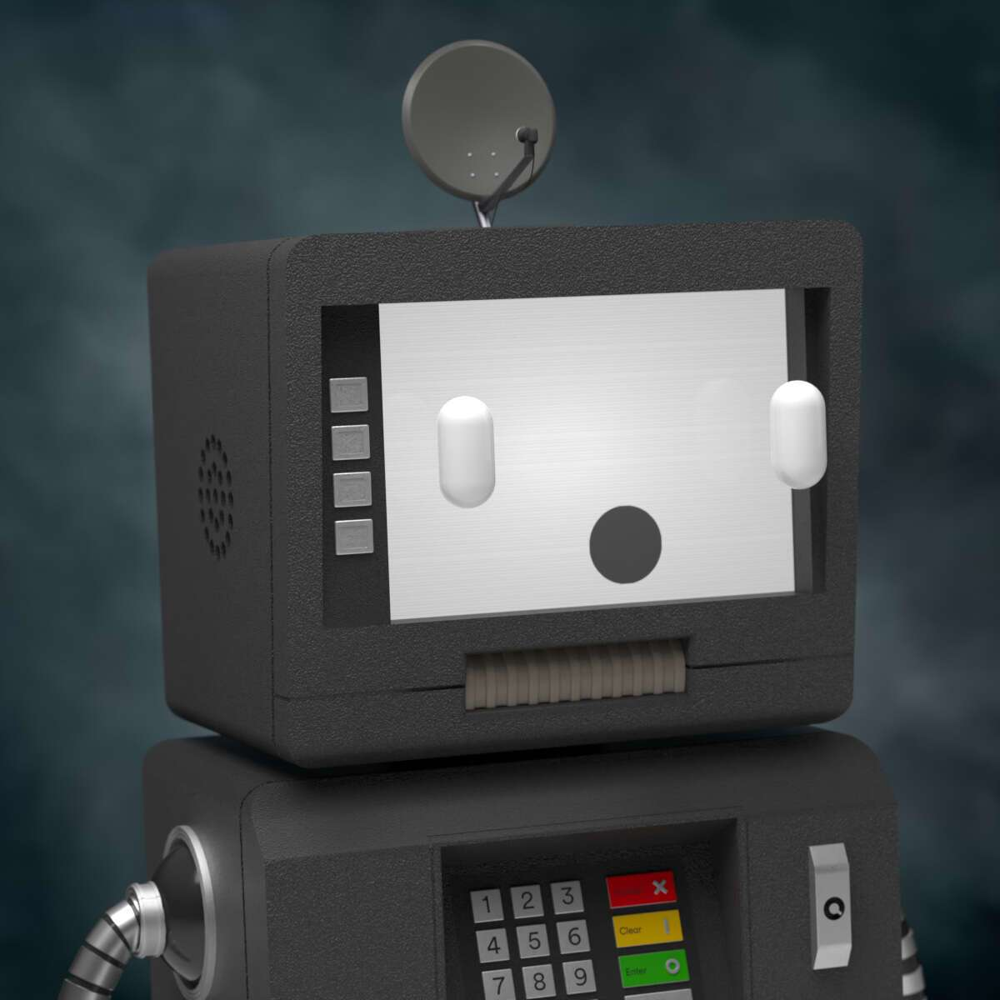

# Pawn Bots

带有 DeFi 路线图的怀旧抵押品 | 一个Hifi.Finance生态系统项目。

在锁定流动性的 NFT 世界中，Pawn Bots 是第一个使用 Hifi 协议的 NFT 抵押品。一旦部署了借贷，您就可以立即释放流动性！ 

特许权使用费和项目收益进入流动资金池，并借给希望借款的持有人！快来了。 

升级掌握在持有者手中。Pawn Bots 是首批让持有者能够在不增加总供应量的情况下定制和升级其 NFT 的项目之一。 

用有限的特性增加稀有度，定制美学，打造终极典当机器人！ 

