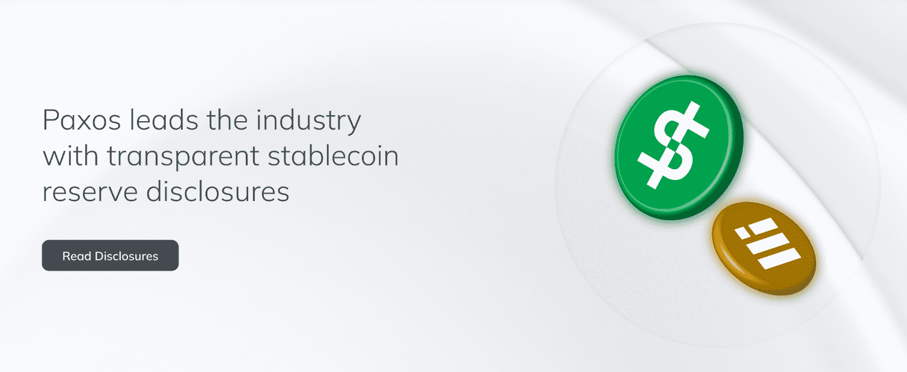

# Paxos Stablecoin

PAX 是一种数字美元。与其他加密资产一样，它可以在世界任何地方、任何时间、任何时间即时移动，并且是可编程的。与其他加密资产不同，PAX 是稳定的。它以 1:1 的比例支持美元，由 Paxos 信托公司发行，因此资金受到精心保护、审计和监管。

今天的金融基础设施陈旧、昂贵且有风险——支持一个让更多人离开而不是让更多人进入的系统。所以我们正在重建它。

 Paxos 正在重新定义金融基础设施。我们的区块链解决方案为企业客户代币化、托管、交易和结算资产，使任何资产在任何时候都可以进行可信和即时的流动。随着经济比以往任何时候都更快地发展，我们致力于创新，使其新的金融体系成为现实——通过在监管框架内工作，我们正在创建一个以诚信为基础的生态系统。

 我们鼓励金融业透明地服务，提高标准，探索新的方式来服务更多的人。

Paxos 是一家资金雄厚的区块链公司，总资金超过 5 亿美元，来自 OakHC/FT、Declaration Partners、Mithril Capital 和 PayPal Ventures 等主要投资者。我们的客户是全球领先的企业。
