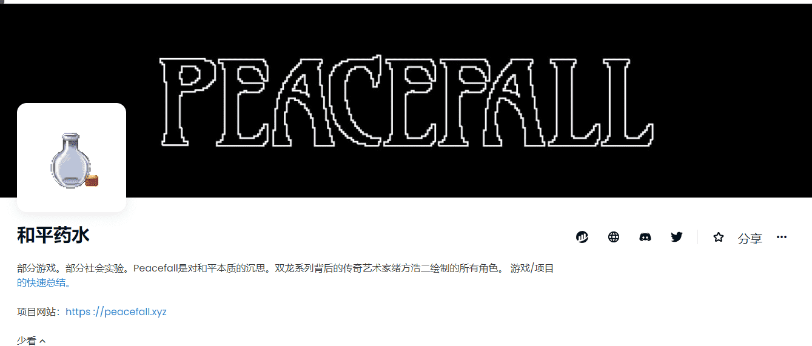

# PeacefallPotion

你的角色在战斗中获胜越多，他们就会变得越强大。随着角色的进化，他们的外貌会发生变化，他们会拥有更强大的武器，他们在游戏中的实力也会增强。查看我们不断发展的 NFT 在 Opensea 上的表现。忍者示例 Spectre，勇士队是由原双龙的艺术家之一 Koji Ogata 手工创作的。对，就是那双龙。他将他的魔力和与经典侧卷轴的联系带到了这个项目中。大多数 NFT 收藏品都有一种稀有性：你在薄荷糖中得到的那种。你的 NFT 永远不会比你在揭幕时得到的更稀有。Peacefall 有两种稀有度：铸造和获得。获得的稀有度来自您在战斗中的表现。您的战士的稀有度和价值会根据您做出的决定而提高。

