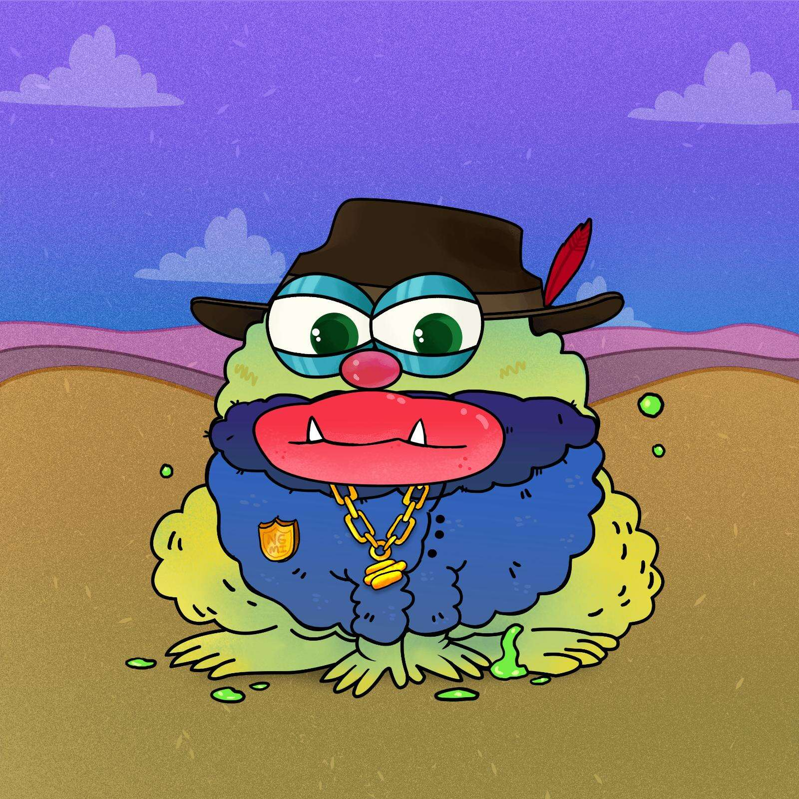

# Peaceful Toadz

Peaceful Toadz 是 Peaceful Groupies 和 crypToadz 跨界项目，旨在将 nft 世界的最佳氛围融合在一起。由这两个系列的最佳融合创造，6666 独特的作品在这里提供从沼泽到月球所需的燃料。

Peaceful Toadz NFT 在过去 7 天内售出 1 次。Peaceful Toadz 的总销售额为 6.48 美元。一份 Peaceful Toadz NFT 的平均价格为 6.5 美元。共有 1,856 名 Peaceful Toadz 所有者，总共拥有 6,666 个代币。

Peaceful Toadz 是一个 NFT（非同质代币）集合。存储在区块链上的数字艺术品集合。

在过去 30 天里，Peaceful Toadz NFT 最便宜的销售额低于 2 美元，最高销售额超过 11 美元。在过去 30 天内，Peaceful Toadz NFT 的中位价格为 5 美元。

