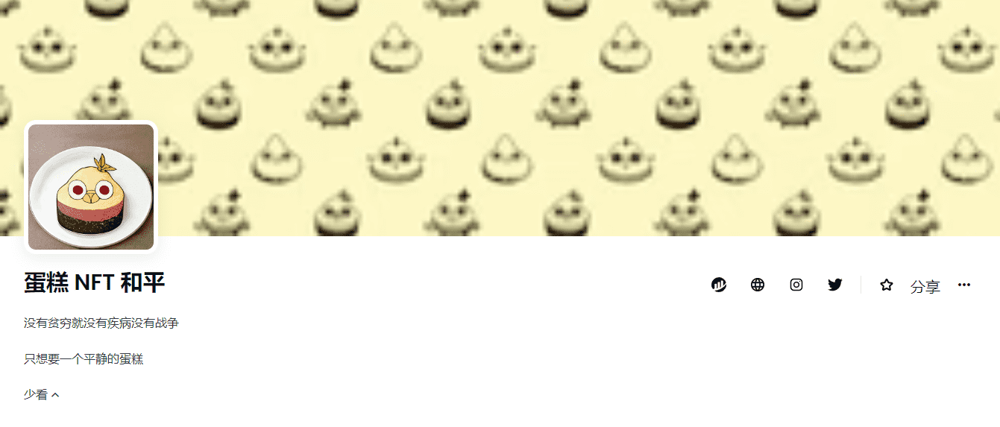

# Peace of Cake NFT

##### ▶ 什么是蛋糕 NFT 的和平？

Peace of Cake NFT 是一个 NFT（不可替代代币）集合。存储在区块链上的数字艺术品集合。

##### ▶ 有多少个Peace of Cake NFT 代币？

总共有 31 个 Peace of Cake NFT NFT。目前，15 位所有者的钱包中至少有一份 Peace of Cake NFT NTF。

##### ▶ 最昂贵的 Peace of Cake NFT 销售是什么？

Peace of Cake NFT NFT 售出的最贵的是 [Peace of Cake](https://www.nft-stats.com/asset/0x1078c0311088ee915af0e8da0b729df7fb3911ba/11)。它于 2022-06-27（2 个月前）以 54.9 美元的价格售出。

##### ▶ Peace of Cake NFT 最近卖出了多少？

过去 30 天内售出了 1 个 Peace of Cake NFT NFT。

