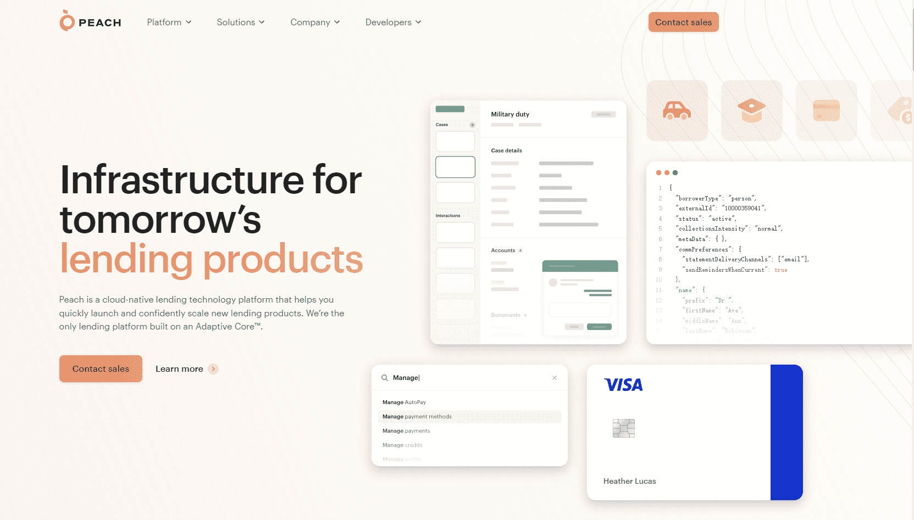

# Peach Finance

Peach Finance 是一种一体化的去中心化金融，您可以在其中赚钱。我们有一个交换平台来交换代币并添加/删除流动性，农场和碗用于产量农业，新项目的初始农场产品。

PEACH 是桃子金融的原生代币。用户可以在提供的所有农场池中交换 PEACH 和农场 PEACH。

在过去十年中，老牌贷方一直在努力跟上金融科技的步伐。为什么？曾经为他们的创新提供动力的技术变得过于僵化，无法满足当今的需求。

变化只是在加速。未来，贷方将需要迅速适应——否则将面临淘汰。Peach 的借贷平台是第一个围绕全新范式（Adaptive Core™）设计的平台，专为适应借贷的未来而量身定制。

Peach 的自适应借贷平台旨在支持任何资产类别，具有 200 多个配置变量，并围绕现代用户体验原则进行设计，使贷方能够在启动时和规模上进行调整，因此他们可以始终处于领先地位。

我们建立 Peach 是因为每个贷方都是创新者的世界不仅对贷方来说是一个美好的世界，而且对每个人来说都是一个更美好的世界。
