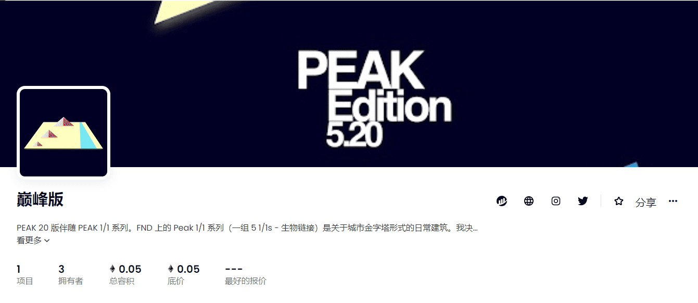

# PEAK Edition

是关于城市金字塔形式的日常建筑。我决定为版本选择这件作品，因为它最直接地引用了统一 Peak 系列的隐喻。版本是吉萨金字塔和尼罗河大致位置的抽象，以山顶建筑的照片代表胡夫、哈夫拉和门考雷。该版本引入了 Peak 系列的隐喻，但更重要的是，它让我们想起了建筑本身的魔力。为了测量，建造者只有太阳、月亮、星星和行星。然而，金字塔几乎完美地与地球的基点对齐，精确度为 1 度的十五分之一。美丽+精准。顶峰！

