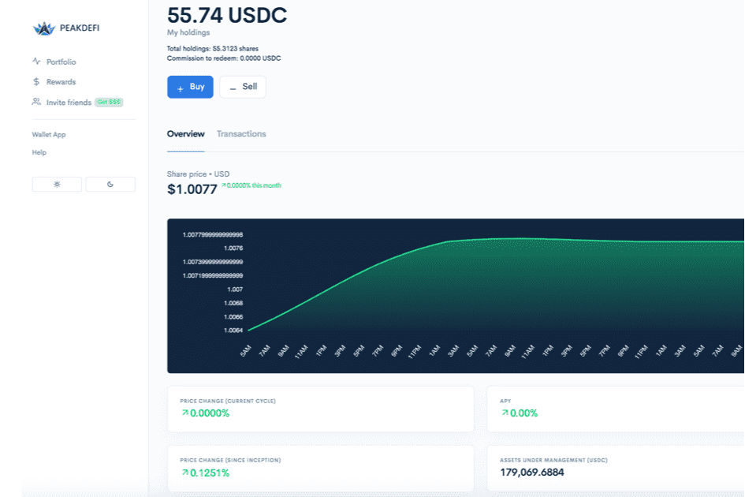

# PEAKDEFI

PEAKDEFI 是一个在以太坊区块链上推出的 DeFi 平台，现在也在币安智能链上推出。在以太坊区块链上，创建 PEAKDEFI 是为了扰乱整个投资环境。尽管当前的解决方案存在很多缺陷，尤其是对于小投资者和资产管理公司而言，PEAKDEFI 开辟了一条全新的道路，为所有人创建了一个全球基金，对所有人透明，由所有人共同管理，以达到市场的峰值。除了投资 PEAKDEFI 全球基金外，PEAKDEFI 还提供对 Binance Smart Chain 的 Staking。您可以通过质押 PEAK 来增加您的资本。在非常基本的层面上，“质押”意味着将您的加密资产锁定一段时间以用于特定目的。关于峰值，通过将您的PEAK锁定在PEAKDEFI平台上，您将获得减少市场当前流通供应并稳定PEAK价格的奖励。PEAK 总供应量的 50%（转换为 10 亿 PEAK）保留用于在以太坊和币安智能链上进行质押奖励。**您每年可以在 PEAK Staking 中赚取高达近 83% 的收益！**

在 PEAKDEFI，安全性具有最高优先级。该系统由最好的智能合约安全公司之一的 Quantstamp 审查和审计，以确保 PEAKDEFI 基金和 Staking 过程的安全。

