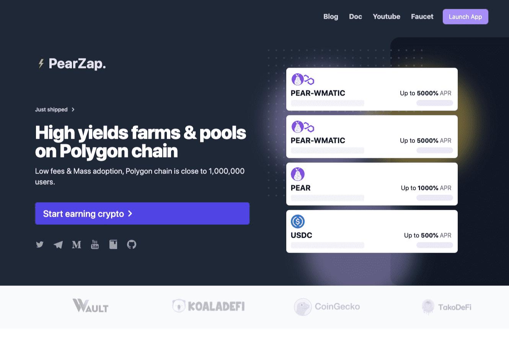

# PearZap

多边形链上的高产农场和游泳池💰 

安全、经验丰富的团队、创新的农场功能🍐🚜

低费用和大规模采用，Polygon 链接近 1,000,000 个用户。

## 为什么选择和信任 PearZap

安全

- 高度关注智能合约的安全性
- 我们的智能合约中没有迁移代码和代理
- 启动前成功的安全审计
- 自发布以来的时间锁定
- Timelock 开发者和项目资金地址由 Ledger 的硬件钱包保护
- 反鲸鱼和反机器人功能

社区驱动

- 社区驱动：我们密切关注我们的社区，项目优先级将由我们的社区定义和投票
- 功能公平发布：每个新功能都从每个人都可以访问的确定区块开始
- 有竞争力的押金费用：押金费用将在项目期间根据需要进行调整，以保持对新投资者的吸引力。

公平发射

- 在启动时预售大量流动性并快速稳定价格
- 预售初始流动性锁定

长期和经验

- 来自以太坊生态系统的经验丰富的开发团队
- 即将在 BSC、xDai 和 Fantom 链上部署

