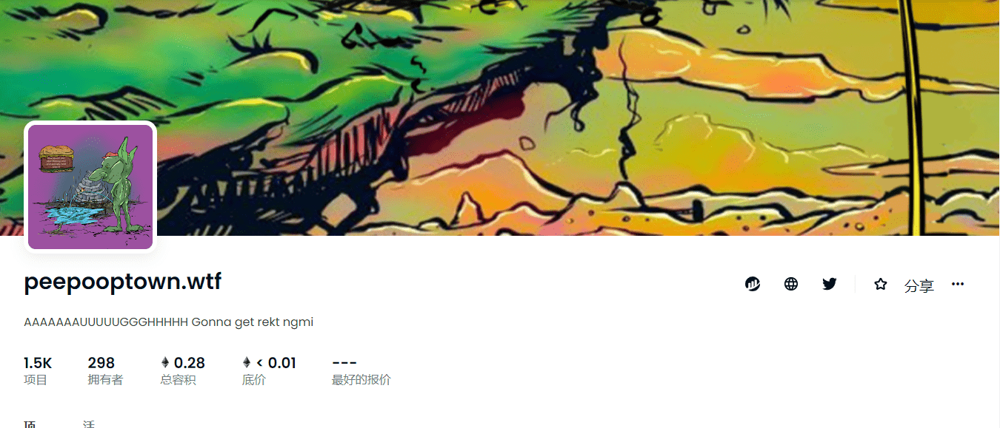

# peepooptown.wtf

##### ▶ 什么是 peepooptown.wtf？

peepooptown.wtf 是一个 NFT (Non-fungible token) 集合。存储在区块链上的数字艺术品集合。

##### ▶ peepooptown.wtf 代币有多少？

总共有 1,500 个 peepooptown.wtf NFT。目前，298 位所有者的钱包中至少有一个 peepooptown.wtf NTF。

##### ▶ peepooptown.wtf 最贵的交易是什么？

出售的最昂贵的 peepooptown.wtf NFT 是 [peepooptownwtf #934](https://www.nft-stats.com/asset/0x1072aafb1342bfda676b04121fffd3ddbdd27ed7/934)。它于 2022-06-20（2 个月前）以 8.8 美元的价格售出。

##### ▶ peepooptown.wtf 最近卖出了多少？

过去 30 天内售出了 4 个 peepooptown.wtf NFT。

##### ▶ 什么是流行的 peepooptown.wtf 替代品？

许多拥有peepooptown.wtf NFT的用户还拥有 [Bit-Balls](https://www.nft-stats.com/collection/bitballs)， [AIKaijuz](https://www.nft-stats.com/collection/aikaijuz)， [吃我的肉喝我的血。](https://www.nft-stats.com/collection/eat-my-flesh-and-drink-my-blood-you-will-live-for)[你将永生](https://www.nft-stats.com/collection/eat-my-flesh-and-drink-my-blood-you-will-live-for)和 [GoblinApes](https://www.nft-stats.com/collection/goblinapes)。

