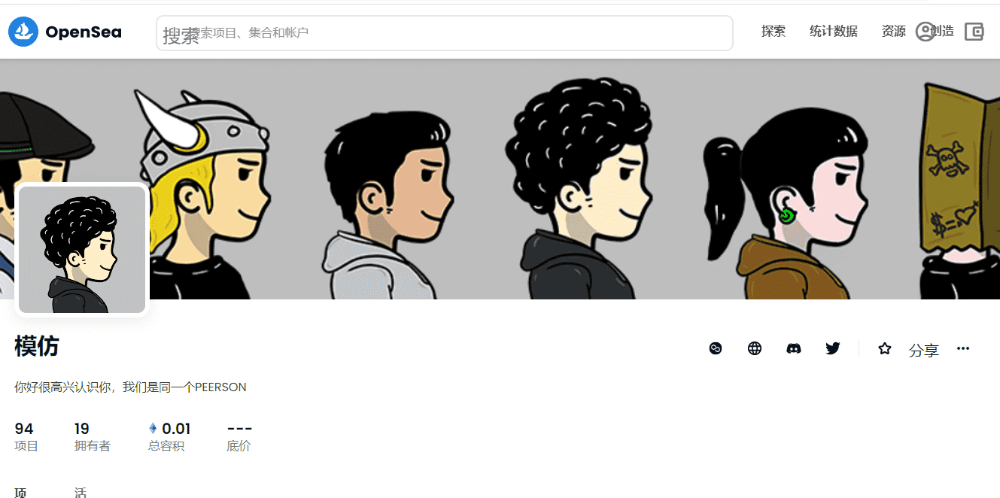

# Peersonate

##### ▶ 什么是模拟？

Peersonate 是一个 NFT（不可替代令牌）集合。存储在区块链上的数字艺术品集合。

##### ▶ 存在多少个 Peersonate 代币？

总共有 94 个 Peersonate NFT。目前，19 位所有者的钱包中至少有一个 Peersonate NTF。

##### ▶ 最昂贵的 Peersonate 销售是什么？

出售的最昂贵的 Peersonate NFT 是 [Peersonate #6](https://www.nft-stats.com/asset/0x0f12806e939171476e8eff11ddfcc4306859b478/5)。它于 2022 年 6 月 29 日（2 个月前）以 5.5 美元的价格售出。

##### ▶ 最近卖出了多少 Peersonate？

过去 30 天内售出了 1 个 Peersonate NFT。

