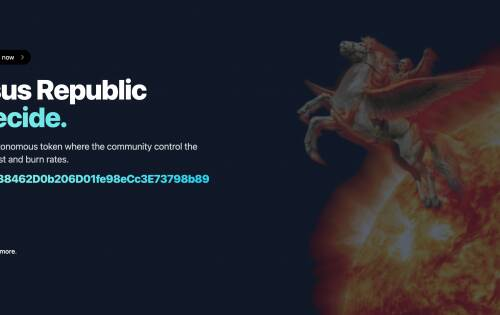
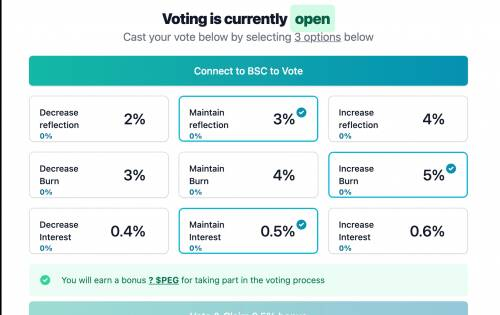

# Pegasus Republic

飞马共和国 - 你决定。鲍勃·霍斯曼是谁？

一个去中心化的自治代币，社区控制通货膨胀、税收、利息和燃烧率。

Pegasus Republic 是 SafeMoon 合约的一个分支，它用社区投票取代了开发者的控制权和影响力。现在您可以决定燃烧、税收、利息和通货膨胀率。

**阶段1**

投票开始

每个 hodler 可以在下方投票，并在当前持有的资产之上获得**0.5%的奖金。**奖金被锁定，直到投票期结束。投票期为一周，每个账号只能投票一次。

**第二阶段**

结算期

在结算期间不能再投票。这让社区有时间调整并为即将到来的代币经济学变化做准备。

**第三阶段**

代币经济学已更新。

**计算投票并自动**更新燃烧、税收和利率。新的投票期在前一期结束的同一天开始。

Bob Horseman 是飞马共和国的总统，也是最大的代币持有者。他无法从 Pegasus Republic 提取任何资金，因为他是所谓的烧毁地址。这让他成为史上最值得信赖的总统！

