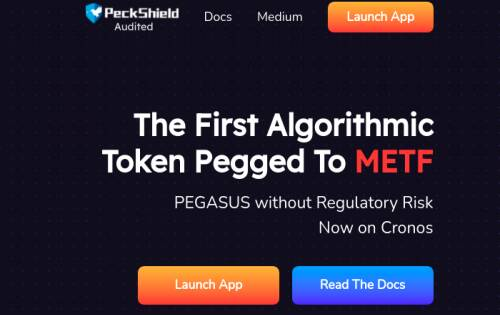
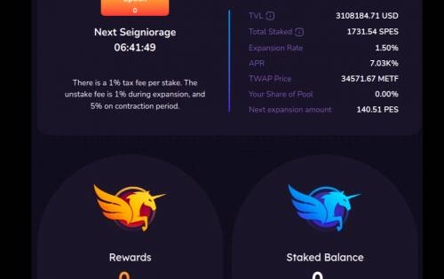
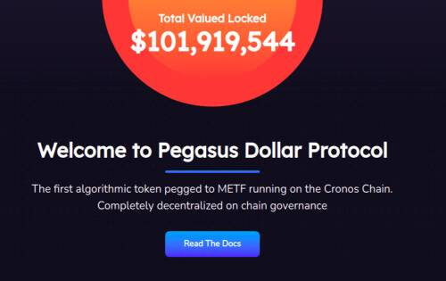

# Pegasusdollar.finance

Pegasus Dollar 是一种与 METF 挂钩的算法代币

该协议旨在扩大和收缩供应，类似于中央银行交易财政债务以稳定购买力的方式，没有任何基础或抵押风险。

PES 和 SPES 代币通过收益耕作公平分配。为 PES-METF 和 SPES-METF 对提供流动性会导致分配额外的 SPES 代币。这不仅使我们能够保持我们的审查阻力，而且还可以作为一种激励机制来防止缺乏流动性和债券死亡螺旋。

安全性对于任何 IT 公司来说都是至关重要的，尤其是在区块链公司中。

对于 PegasusDollar，我们开发 Pegasus 的早期原则之一是保证安全的环境，确保玩家和 Pegasus 智能合约的利益。

因此，在完成智能合约后，我们还与 2 个非常有信誉的合作伙伴进行了审计。这些是 PeckShield 和 SolidProof，它们都给出了非常积极的结果。

