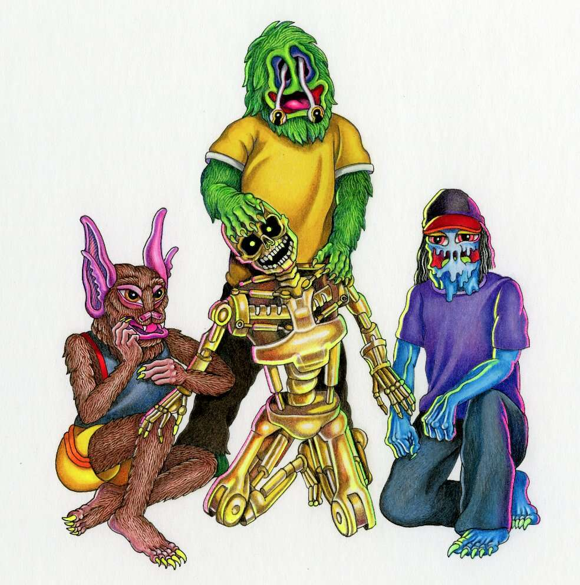

# PEGZ

PEGZ 是一系列 100 个独特的收藏品，每一个都是由 Matt Furie 以数字方式绘制的。每个 Peg 角色都是一个家庭的成员，是 10 种类型之一，包括以最稀有形式出现在这里的“Pepe”。

Matt 的庞大角色世界以可收藏/可交易文件的形式栩栩如生，每个文件都有一个 2D 头像 .PNG 文件、一个 3D .GLB 硬币文件和一个动画 .GIF 文件。

PEGZ 项目诞生于马特专注于数字创作的作品之际，并为收藏家提供了一个独特的机会，让他们可以进入他庞大的奇异突变体和角色世界，同一个世界单独催生了有史以来最具标志性的互联网生物佩佩青蛙。

欢迎来到pegz.fun！我一直在挖掘我的大脑，为你带来这些元宇宙的种子。愿这些新变种人的面孔为您带来数字梦境中的欢乐、好运和好运。

