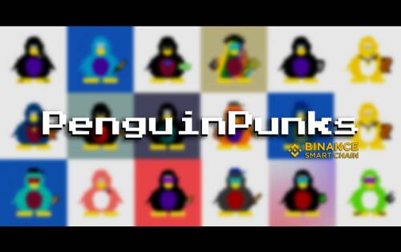

# PenguinPunks

PenguinPunks 是由计算机生成的 10,000 个独特的收藏角色，其所有权证明存储在币安智能链上。PenguinPunks 是您可以铸造、拥有和交易的酷炫新 NFT。

一款类似于 Club Penguin（但使用区块链）的游戏，用户可以使用他们的 PenguinPunk 与其他 PenguinPunk 所有者聊天、漫游、放松和玩耍，它正在开发中（可能）。

他们将努力使这成为现实。

每个 PenguinPunk 持有者都可以查看和下载他们的企鹅的 3D 版本。这个 3D 版本是一个 GIF，它是他们企鹅的 8 个不同角度的组合。

通过铸造 PenguinPunk，您不仅可以获得自己的 NFT，还可以帮助对抗世界饥饿！

PenguinPunks 将把总收入的一部分捐赠给币安慈善机构，以帮助结束世界饥饿。这个百分比将由社区决定。 
