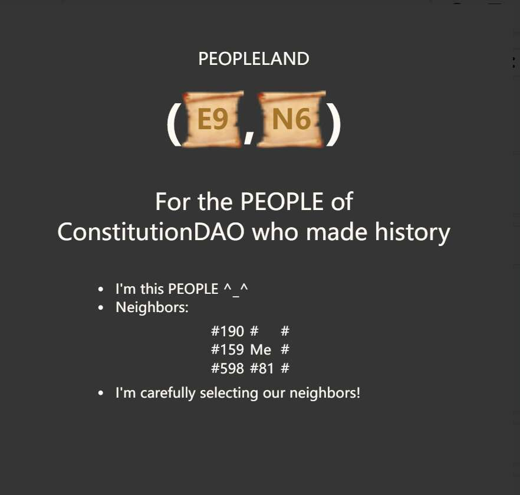

# PeopleLand

对于创造历史的宪法道的人

规则

捐赠者可以免费铸造一块土地

获得“土地”的人现在是人

一个人最多可以邀请另外两个人

要邀请一个人，您可以铸造土地并将其提供给他/她

只有一个人可以成为一块土地的所有者

每个人只能接受一次邀请

邻居

PEOPLELAND 永远保存邀请和邻居的关系。

得到邀请是一种荣誉，土地的价值是由邻居决定的，请小心邀请邻居！

解释

土地是具有 (x,y) 坐标的空间。正x是东，负是西，正y是北，负y是南。x 和 y 的每个值只能是一个数字整数，最大可能范围没有限制，每个坐标位置代表一个 100 的区域

