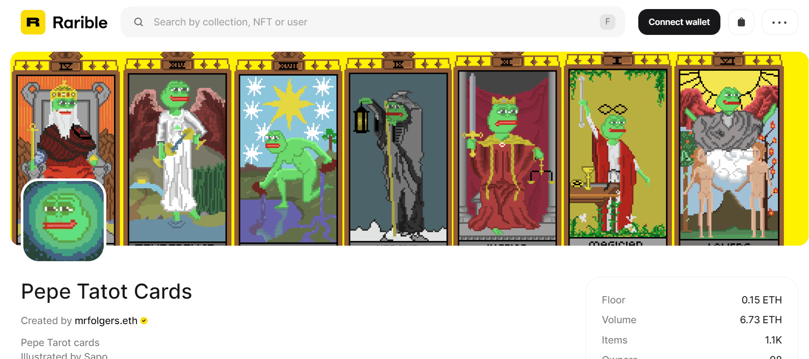

# Pepe Tarot Cards

项目网站、社交联系方式、项目介绍内容详见

佩佩塔托卡片 萨波插图的佩佩塔罗牌 

 Pepe Tarot Cards 是一个 NFT（非同质代币）集合。存储在区块链上的数字艺术品集合。

总共有 43 张 Pepe Tarot Cards NFT。目前，99 位所有者的钱包中至少有一张 Pepe Tarot Cards NTF。希望它是一个团队建设的企业，如果有兴趣评论或 DM，

