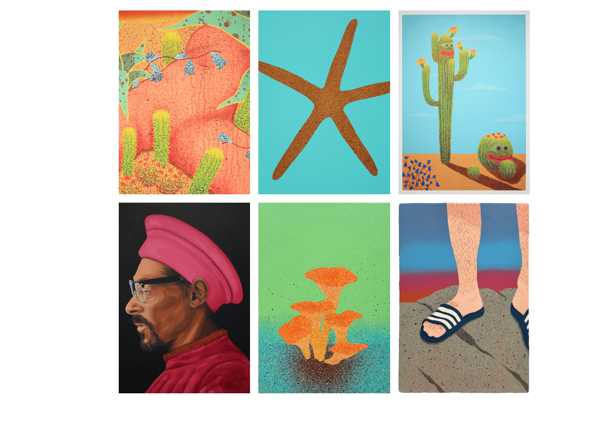

# PEPEFLOWERS

花椒 这些天人们需要鲜花。路易斯·西莫的 CC0 艺术。持有人免费。

请享用术家和收藏家。我画画PEPERNICA，木头上的油，喷雾和搪瓷，7.77x3.48 米，分为 21 个模块。感谢生活和我所有的收藏家，你们让这成为可能#FEELSGOODMAN

PEPEFLOWERS NFT 在过去 7 天内售出 4 次。PEPEFLOWERS 的总销售额为 74.65 美元。一份 PEPEFLOWERS NFT 的平均价格为 18.7 美元。共有 80 位 PEPEFLOWERS 所有者，拥有 500 个代币的总供应量。

