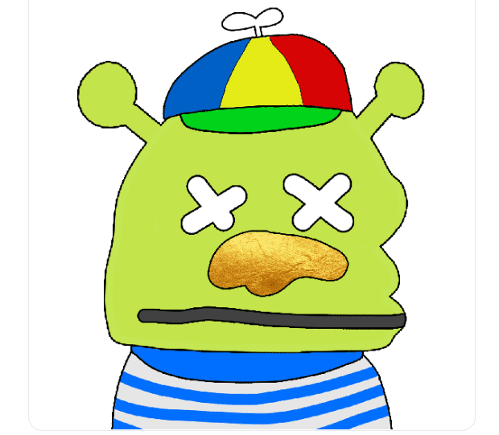

# Pepepes

佩佩蛙是艺术家Matt Furie创作的卡通青蛙，在互联网上激发了无数的二次创作，包括Rare Pepes（稀有佩佩），这是区块链上的第一个艺术实验之一。

我们是文化！我们是佩佩斯！我们是免费薄荷！我们是 2K。

什么是Pepepes？
Pepepes 是一个 NFT（不可替代令牌）集合。存储在区块链上的数字艺术品集合。
有多少个 Pepepes代币？
总共有 7,000 个Pepepes NFT。目前，485 位所有者的钱包中至少有一个 Pepepes NTF。
最近卖了多少个Pepepes？
过去 30 天内售出 0 个 Pepepes NFT。
什么是流行的 Pepepes 替代品？
许多拥有 Pepepes NFT 的用户还拥有 BloodyApeFromHell、 Kiddy Kongz、 EOC 的 Elves和 Zombie Okay Bears。

