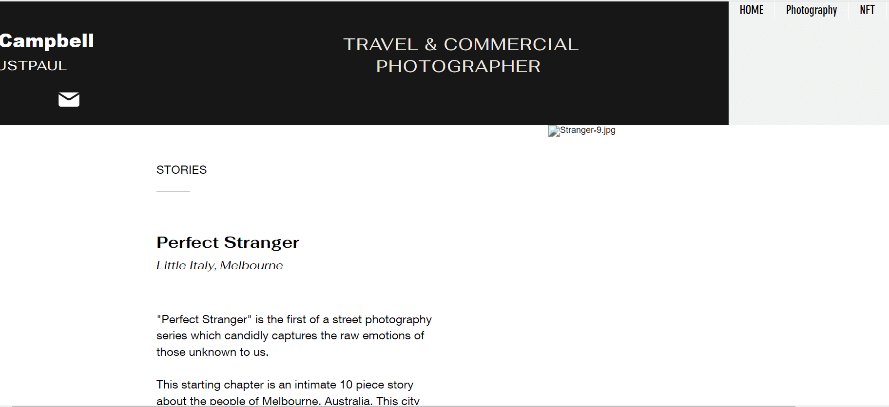

# Perfect Stranger

项目网站、社交联系方式、项目介绍内容详见：

《完美陌生人》是街头摄影系列的第一部，它坦率地捕捉了我们不知道的人的原始情感。 

这一章是一个关于澳大利亚墨尔本人民的亲密故事，共有 10 篇。这座城市多年来一直是我的家，正是在这些街道上，我得以发展我的街头摄影方法。我对它和人们深表感谢。

人们观看一直让我着迷，我觉得正是在这些微小的时刻，我们才能真正了解人们的生活。从这些时刻开始，我喜欢创造将他们带到这里的背景故事和场景。 

让我们重新与周围的人联系，哪怕只是片刻。

