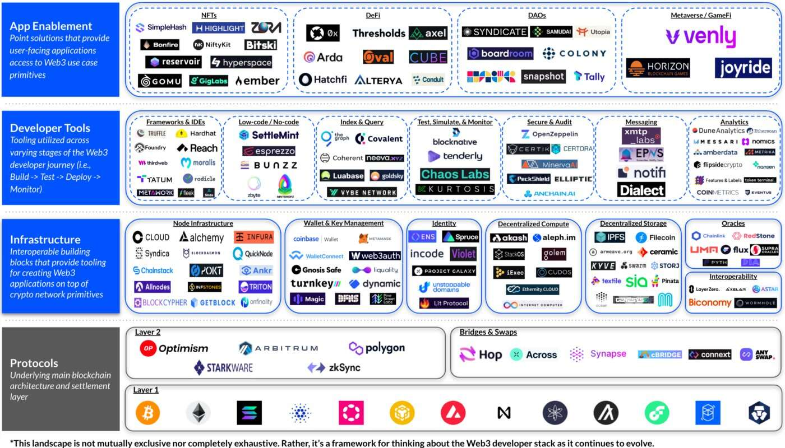

# Permies

Permies 是 Web2 工作者，他们在日常工作中苦苦挣扎，向往更美好的未来——一个充满财务自由、世界旅行和志同道合的朋友的未来。在浏览 Blockworks 的网站消磨时间时，555 Permies 从 Web3 的兔子洞中发射出来，发现自己处于完全无需许可的未来。

您的 Permie 是您进入 Permissionless 2022 的 VIP 通行证。2022 年 5 月 17 日至 19 日，Blockworks 与 Coinbase 和 Bankless 合作，接管棕榈滩，举办年度 web3 文化活动。感谢我们的持有者和支持者参加并使其成为一次难忘的经历——我们已经期待为 Permissionless 2023 提供更多价值。

