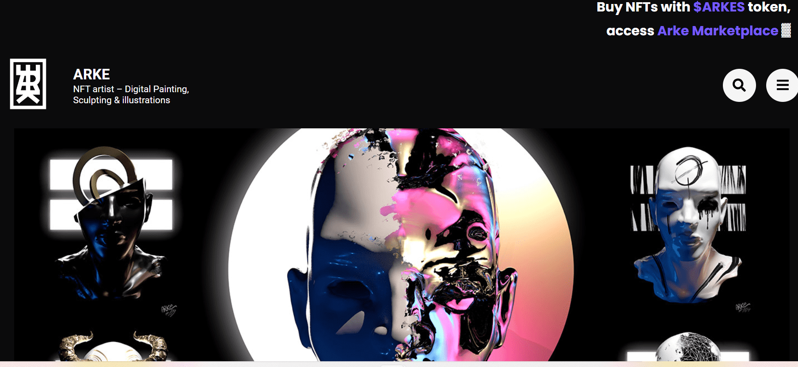

# Personae Project

项目网站、社交联系方式、项目介绍内容详见：

Persona \pɛʁ.so.na\ 指个人人格的公众形象，或所承担的社会角色，或虚构人物。这个词源自拉丁语，最初是指戏剧面具。

阿尔法 NFT 艺术家 – 数字绘画、雕刻和插图

为了让它保持人类大小，并且因为它是第一个没有随机生成过程的**艺术项目，** **Personae**的最大供应量为**1000**。

章节就像季节，每个章节都有100 个由Arke设计的独特角色。当新章节开始时，**每周都会**产生10 个新角色

