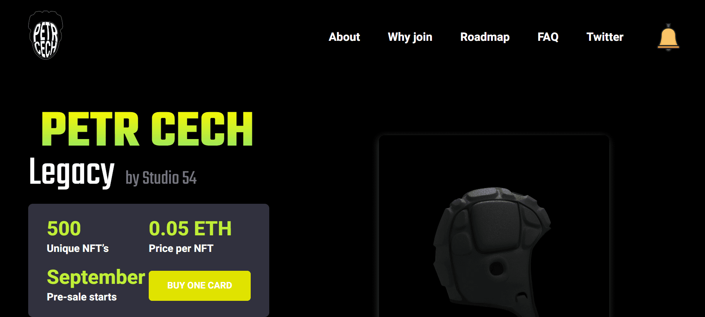

# Petr Cech

项目网站、社交联系方式、项目介绍内容详见：

欢迎来到 PETR CECH Petr Cech 被众多球员、专家和经理描述为历史上最伟大的守门员之一，可以说他与英超联赛历史上最伟大的守门员彼得·舒梅切尔并驾齐驱。

是一名前捷克职业足球运动员，目前在英超俱乐部切尔西担任技术和表现指导。他还作为吉尔福德凤凰队的守门员打半职业冰球。

Petr 与 Studio 54 合作，创建了他的 Legacy 系列 NFT 系列，以限量 NFT 版本来纪念他的职业生涯。每个 NFT 都是独一无二的纪念品，由 Cech 进行数字手写签名和编号。

