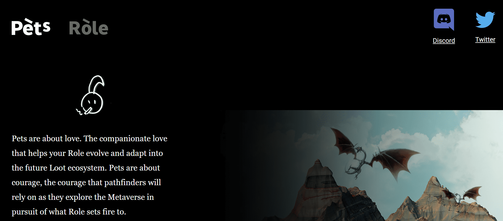

# Pets for Metaverse

项目网站、社交联系方式、项目介绍内容详见：

宠物是关于爱的。伙伴之爱可帮助您的角色发展并适应未来的战利品生态系统。宠物关乎勇气，探路者在探索元宇宙以追寻角色所点燃的东西时将依赖的勇气。

【宠物】、【角色】、【战利品】是什么关系？1. 宠物将随着 [Role] 和 [Loot] 进化，这是将两者结合为 [Role+] NFT 的关键中介。2. [Role+] 的进化只有在所有者将 [Pets]、[Role] 和经过认证的 [Loot] 项目（包括 [Loot]、[mLoot] 等）结合在一起时，由社区决定的未来合作伙伴关系. 请记住，每个[Pets]或经过认证的[Loot]项目只能向[Role]致敬（即在进化中使用）一次。关于[Role+]的更多详细计划将很快发布。

